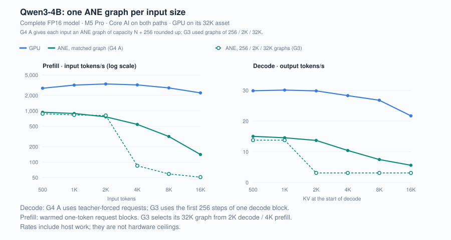
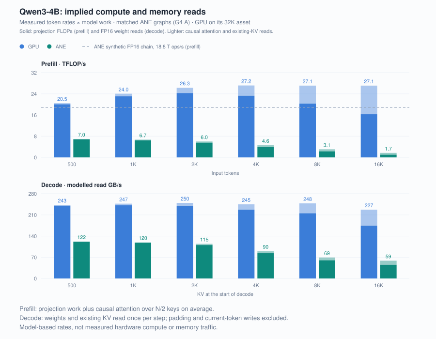
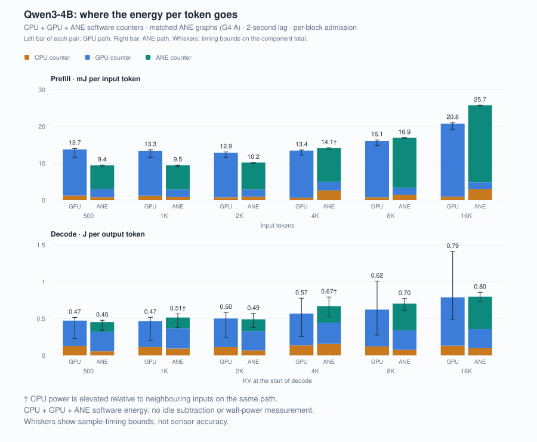
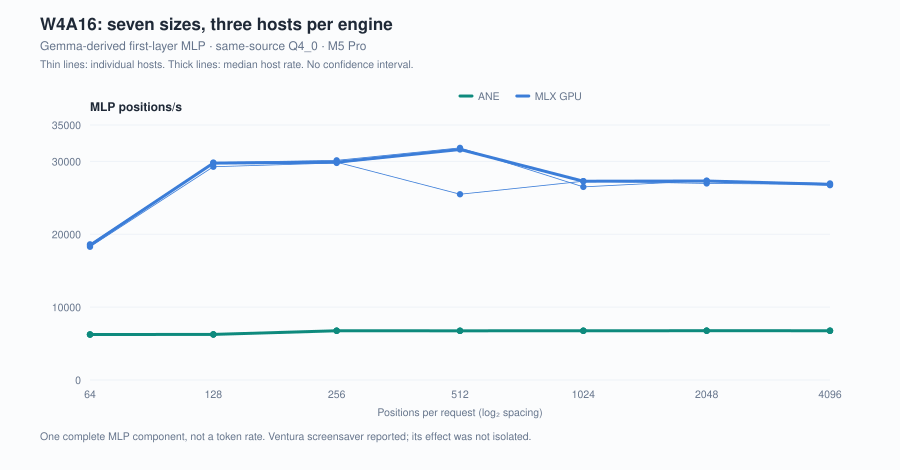
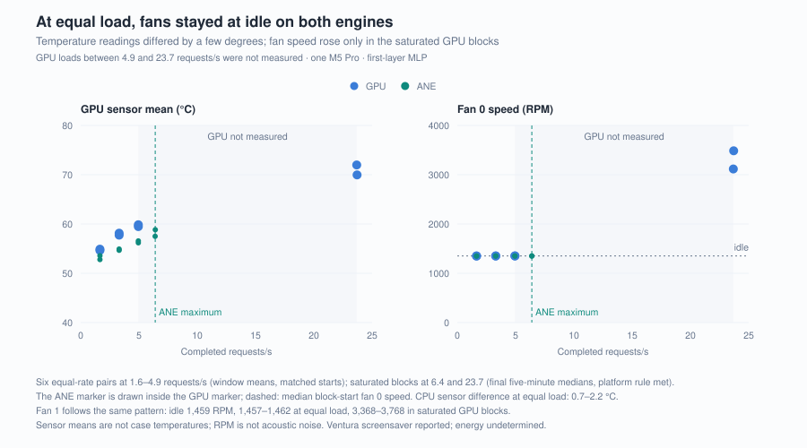

# LLMs on Apple Neural Engine

[English](README.md) | 中文

**完整 LLM 在 Apple Neural Engine 上能跑多快，完成同样的工作需要多少能量？在一台 M5 Pro 上，Qwen3-4B FP16 通过 Core AI 分别运行于 ANE 和 GPU，ANE 为每档输入使用容量匹配的固定图。<!-- claim:g4a.all-contexts@g4a-001 -->500–16K<!-- /claim --> 的每档输入都是 GPU 更快：decode 快 <!-- claim:g4a.decode-gpu-faster@g4a-002 -->2.0–3.9×<!-- /claim -->，prefill 快 <!-- claim:g4a.prefill-gpu-faster@g4a-003 -->2.9–15.9×<!-- /claim -->。<!-- claim:g4a.short-contexts@g4a-004 -->500–2K<!-- /claim --> prefill 时，两次运行中 ANE 每输入 token 的组件能量为 GPU 的 <!-- claim:g6.two-run.short-prefill-energy-x@g6-001 -->0.68–0.81×<!-- /claim -->；decode 为 <!-- claim:g6.two-run.decode-energy-x@g6-002 -->0.86–1.18×<!-- /claim -->。长输入下 ANE 还能用，靠的是图容量与输入匹配：与此前 256 / 2K / 32K 三档图相比，从 <!-- claim:g4a.n.2048@g4a-007 -->2K<!-- /claim --> 起 ANE decode 快 <!-- claim:g4a.vs-g3.long-decode-speed@g4a-008 -->1.80–4.40×<!-- /claim -->，从 <!-- claim:g4a.n.4096@g4a-009 -->4K<!-- /claim --> 起 prefill 快 <!-- claim:g4a.vs-g3.long-prefill-speed@g4a-010 -->2.76–6.40×<!-- /claim -->。**

<table>
<tr>
<td><b><!-- claim:g4a.decode.1024.ane-rate@g4a-011 -->14.56 token/s<!-- /claim --></b><br><sub>从 <!-- claim:g4a.n.1024@g4a-012 -->1K<!-- /claim --> KV 开始的 ANE decode；GPU 为 <!-- claim:g4a.decode.1024.gpu-rate@g4a-013 -->30.09 token/s<!-- /claim --></sub></td>
<td><b><!-- claim:g4a.prefill.500.energy-x@g4a-014 -->0.69×<!-- /claim --></b><br><sub><!-- claim:g4a.n.500@g4a-015 -->500<!-- /claim --> 输入时 prefill 的 ANE / GPU 每输入 token 能量</sub></td>
<td><b><!-- claim:g4a.vs-g3.decode.2048.speed@g4a-016 -->4.40×<!-- /claim --></b><br><sub>从 <!-- claim:g4a.n.2048@g4a-017 -->2K<!-- /claim --> 开始的 ANE decode，匹配容量图对比 32K 图的 <!-- claim:g4a.g3.decode.2048.ane-rate@g4a-018 -->3.11 token/s<!-- /claim --></sub></td>
<td><b><!-- claim:g4a.prefill.1024.ane-tflops@g4a-019 -->6.5 TFLOP/s<!-- /claim --></b><br><sub><!-- claim:g4a.n.1024@g4a-020 -->1K<!-- /claim --> 输入时 ANE 的 prefill 投影算力；GPU 为 <!-- claim:g4a.prefill.1024.gpu-tflops@g4a-021 -->23.1 TFLOP/s<!-- /claim --></sub></td>
</tr>
</table>

**从这里开始：** [完整模型结果](findings/qwen3-4b-graph-capacity/) · [我该用它吗？](#简短的答案) · [什么能用](workarounds/) · [全部发现](findings/) · [复现方法](docs/REPRODUCING.md) · [研究文章](articles/zh/README.md)



每侧每档输入各用一个宿主会话：预热一次，<!-- claim:g4a.repetitions@g4a-048 -->3<!-- /claim --> 次强制续写、各 <!-- claim:g4a.decode-steps@g4a-049 -->256<!-- /claim --> 步 decode 的请求，再做一组只输出 1 个 token 的 prefill 请求。模型加载、预热和静置不计入；速度来自逐 token 时钟。G3 对照使用等长的起始 decode 窗口计算速度与能量。

<!-- claim:g4a.n.1024@g4a-022 -->1K<!-- /claim --> 输入时，<strong>ANE prefill 为 <!-- claim:g4a.prefill.1024.ane-rate@g4a-023 -->887.7 token/s<!-- /claim --></strong>，<strong>GPU 为 <!-- claim:g4a.prefill.1024.gpu-rate@g4a-024 -->3,177.1 token/s<!-- /claim --></strong>，GPU 快 <!-- claim:g4a.prefill.1024.gpu-faster@g4a-025 -->3.58×<!-- /claim -->。输入越长 ANE 降得越多，到 <!-- claim:g4a.n.16384@g4a-026 -->16K<!-- /claim --> 时 GPU 的 prefill 快 <!-- claim:g4a.prefill.16384.gpu-faster@g4a-027 -->15.94×<!-- /claim -->，decode 快 <!-- claim:g4a.decode.16384.gpu-faster@g4a-028 -->3.87×<!-- /claim -->。虚线是此前那次运行，ANE 在 256 / 2K / 32K 三档图中选择：从 <!-- claim:g4a.n.2048@g4a-029 -->2K<!-- /claim --> 开始的 decode 在那里为 <!-- claim:g4a.g3.decode.2048.ane-rate@g4a-030 -->3.11 token/s<!-- /claim -->，这里为 <!-- claim:g4a.decode.2048.ane-rate@g4a-031 -->13.70 token/s<!-- /claim -->。两次使用相同的权重与输入，并在同一宿主实现基础上作了适配，本轮 GPU 速度为 G3 的 <!-- claim:g4a.vs-g3.gpu-speed@g4a-032 -->0.97–1.02×<!-- /claim -->。计时包含宿主和框架工作，比较的是当前实现，不是硬件上限。



这些 token 速率可以换算成模型工作量。prefill 每个 token 要过 <!-- claim:g4a.projection-parameters-cn@g4a-033 -->36.3 亿<!-- /claim --> 个投影权重；把因果注意力也算上，GPU 在各档输入保持 <!-- claim:g4a.gpu-total-tflops-span@g4a-034 -->20.5–27.2 TFLOP/s<!-- /claim -->，ANE 则随输入变长降到 <!-- claim:g4a.ane-total-tflops-span@g4a-035 -->1.7–7.0 TFLOP/s<!-- /claim --> 的区间内。假设 decode 每步读取一次 <!-- claim:g4a.weight-bytes@g4a-036 -->8.04 GB<!-- /claim --> 的 FP16 权重与已有 KV，GPU 的推算读取速率从 <!-- claim:g4a.n.500@g4a-037 -->500<!-- /claim --> 到 <!-- claim:g4a.n.16384@g4a-038 -->16K<!-- /claim --> 都在 <!-- claim:g4a.gpu-read-span@g4a-039 -->227–250 GB/s<!-- /claim --> 之间，与带宽主导的 decode 一致。ANE 的推算值在 <!-- claim:g4a.ane-read-span@g4a-040 -->59–122 GB/s<!-- /claim --> 之间下降，降幅超过新增 KV 读取所能解释的部分；注意力计算、固定图工作与宿主开销尚未区分。这些都是按模型推算的速率：没有测量设备计数器或内存流量，字节模型不计填充和当前 token 的写入。



汇总 G4 A 与 G6 的各输入测点，<!-- claim:g6.short-contexts@g6-005 -->500–2K<!-- /claim --> prefill 的 ANE 每输入 token 组件能量为 GPU 的 <!-- claim:g6.two-run.short-prefill-energy-x@g6-006 -->0.68–0.81×<!-- /claim -->，<!-- claim:g6.long-contexts@g6-007 -->4K–16K<!-- /claim --> prefill 为 <!-- claim:g6.two-run.long-prefill-energy-x@g6-008 -->0.90–1.33×<!-- /claim -->，decode 为 <!-- claim:g6.two-run.decode-energy-x@g6-009 -->0.86–1.18×<!-- /claim -->。这些范围包含不同输入长度和两次运行；图中展示 G4 A。[配对结果](findings/qwen3-4b-graph-capacity/#repeat-and-decode-query-width)列出同输入的跨轮变化。

图中 G4 A 的 ANE 路径 decode 窗口内，组件能量有 <!-- claim:g4a.ane-arm-gpu-decode-share@g4a-046 -->32–58%<!-- /claim --> 记在整机 GPU 计数器上，尚未归属到具体进程或算子。这些是不扣空载、逐块验收的 CPU＋GPU＋ANE 软件能量估计；ANE <!-- claim:g4a.n.4096@g4a-047 -->4K<!-- /claim --> 两个块运行期间 CPU 计数器被其他活动抬高。† 标记 CPU 功率高于相邻档的块。须线描述采样时间边界，不代表传感器精度；这些不是整机输入电量。

[方法与边界](docs/SCOPE.md#g4-a-matched-graph-observations) · [详细文章](articles/zh/06-按输入匹配的ANE固定图.md) · [此前 256 / 2K / 32K 三档图的结果](findings/qwen3-4b-prefill-decode/)

## 在什么机器上测的

| 机器 | 内存 | 系统 | Xcode | 工具链 |
|---|---|---|---|---|
| **Apple M5 Pro** | 48 GiB | macOS 27.0 | 27.0、26.6 | Core AI · MLX 0.32.2 · coremltools 9.0 · coreai-torch 0.4.1、0.4.2 |

每轮实验的版本随各自结果保存，按轮次的汇总见 [SCOPE.md](docs/SCOPE.md)。

## 简短的答案

| 如果你的模型是…… | 在当前工具链上 |
|---|---|
| **完整 Qwen3-4B FP16** | [GPU 在每档已测输入都更快](findings/qwen3-4b-graph-capacity/)，ANE 用上按输入匹配的图也一样。短 prefill 的 ANE 组件能耗较低；decode 每 token 能量接近。在[直接跳到 32K 的三档图](findings/qwen3-4b-prefill-decode/)上，长输入在 ANE 上慢得多，也更耗能 |
| **本次新增 1 或 2 个位置 decode 函数的 Qwen3 静态图** | [ANE 请求失败](findings/ane-short-decode-query/)，返回 `0xe00002c2` 后宿主退出；4 和 8 个位置的对照可以运行。Qwen3-4B 用 4 个位置代替 8 个，decode 速度为原来的 <!-- claim:g6.q4-q8-speed@g6-014 -->1.001–1.008×<!-- /claim --> |
| **连续多次加载 ANE 模型** | [ANE 编译服务可能一直开着每个已删除的编译输入](findings/ane-compiler-service-disk/)：一次运行中被占住 <!-- claim:g4a.disk.held@g4a-050 -->178.4 GiB<!-- /claim -->，直到服务退出才释放。[回收方法](workarounds/#4-reclaim-disk-space-held-by-the-ane-compiler-service) |
| **使用 iOS 4-bit palettization 预设的 Qwen3-4B**，经 Core AI、首选 ANE | [ANE 编译失败，模型改在 GPU 上运行](findings/coreai-palettized-weights-gpu/)，宿主收不到错误，检查的首输出通过导出码对应的 CPU 参考：<!-- claim:g6.n.1024@g6-015 -->1K<!-- /claim --> decode 为 <!-- claim:g6.w4.decode.1024.rate@g6-016 -->2.87 token/s<!-- /claim -->，ANE 上的 FP16 快 <!-- claim:g6.w4.fp16-faster-decode@g6-017 -->5.1–8.1×<!-- /claim --> |
| **测过的 Core ML direct signed-INT4 K64 图**，每行两个 K32 scale | 数值正确、选择 CPU。相关历史图报告 `ANE only support per-cout/per-tensor quantization`，不是所有 Q4 格式或表示的测试 |
| **K32 拆分**为按输出通道的 scale | Core AI 小型兼容探针通过；独立合成消融[慢约 4 倍](findings/split-decomposition-cost/)，不是通用代价 |
| **分组 4-bit 走 Core AI 原生 LUT 路径** | 接受、确有 ANE 活动，[并且算错](findings/coreai-flattened-scale/)——4096 个值里错 1921 个，且可预测 |
| **原生 ANE 宿主上的 W4A16 服务** | [约为 GPU 速度的四分之一](findings/w4a16-service-tradeoffs/)。相同负载下两侧风扇都在怠速；矩阵前台在 ANE 同跑时尾延迟代价更小。能耗未判定 |
| **常驻执行** | 历史 Python gate 每调用保留 1,966,080 字节；两个原生 G2 宿主各做了 33,728 次 stage 调用，结束时小 60–62 MiB；[无限期常驻未测](findings/iosurface-per-call-growth/) |
| **W4A16 对比 A8W4** | 取决于每次调用的位置数。一个真实 E4B gate 走 Core AI 时，A8W4 在 64 个位置下为 W4A16 速度的 <!-- claim:g7.coreai.gate.64.a8w4-over-w4a16.speed@g7-101 -->0.976–0.990×<!-- /claim -->，[在 1024 个位置下为 <!-- claim:g7.coreai.gate.1024.a8w4-over-w4a16.speed@g7-102 -->1.359–1.360×<!-- /claim -->](findings/quantized-speedup-conditions/#positions-per-call-on-a-real-projection)。历史 4K 配对循环调用 64 个位置的资产，[为 1.013×](findings/ane-vs-gpu-prefill/) |
| **测过的 W8A8 合成控制** | 可加速——Core AI 受控 128 层链相对自身 FP16 基线为 **1.86–1.87×**。[收益取决于每次调用的工作量，也取决于权重](findings/quantized-speedup-conditions/)：A8W4 单层时速度为 W4A16 的 <!-- claim:g1w.depth.both-1.speed@g1w-001 -->0.86×<!-- /claim -->，128 层时 <!-- claim:g1w.depth.both-128.speed@g1w-002 -->1.33×<!-- /claim -->；精确零权重让 FP16 本身快 <!-- claim:g1w.density.old.speed@g1w-003 -->1.88×<!-- /claim --> |
| **Gemma 4 E4B mobile QAT A8W4**，首层 MLP | [算错，而且不更快](findings/quantized-speedup-conditions/#a-released-qat-checkpoint)。ANE 上的 QDQ 乘法[用了另一个 QDQ 的 scale](findings/coreai-qdq-multiply-scale/)，走 Core ML 和走 Core AI 都一样：单个 MLP 偏差 <!-- claim:g1w.e4b.1.native.l2@g1w-004 -->339%<!-- /claim -->。加乘积裁剪后，重复八个 MLP 仍偏差 <!-- claim:g1w.e4b.8.clip-product.l2@g1w-005 -->21.6%<!-- /claim -->，速度为 W4A16 的 <!-- claim:g1w.e4b.clip-product.speed@g1w-006 -->0.976×<!-- /claim --> |
| **用 Core ML 代替 Core AI**，同一份 E4B 码在 ANE 上 | [FP16 和 W8A8 速度相同](findings/coreml-coreai-same-codes/)（分别为 Core AI 的 <!-- claim:g7.ml-over-ai.fp16.speed@g7-103 -->0.979–0.998×<!-- /claim --> 和 <!-- claim:g7.ml-over-ai.w8a8.speed@g7-104 -->0.962–0.967×<!-- /claim -->）。Core ML 的 4-bit 查表图只有 Core AI 速度的 <!-- claim:g7.ml-over-ai.four-bit.speed@g7-105 -->0.065–0.280×<!-- /claim -->，比 Core ML 自己的 FP16 还慢 |

早期轮次作为独立记录保留。历史 Python MLP 中，64 位置时 GPU 快 **2.87×**，1024 时 **5.09×**，
4096 时 **4.41×**，每侧单进程且提前停止；之后原生 C256 在 4096 位置为 582.19 ms，同轮 GPU 为
152.25 ms，原生 `run` 时间仍包含运行时与同步。[Python 轮次](findings/ane-vs-gpu-prefill/) ·
[原生后续记录](results/historical/native-mlp-followup.json)。各数字的边界
见 [SCOPE.md](docs/SCOPE.md)。

## 仓库里有什么

完整模型与组件实验分别有自己的证据：

| 部分 | 内容 |
|---|---|
| 🔧 **四件真正能用的事** | 让分组 4-bit 能上加速器的那个改写、修好 QDQ 乘法的图表达、链足够深时能加速的那种量化方案，以及回收 ANE 编译服务占住的磁盘空间——每一件都写清了代价和边界。[workarounds/](workarounds/) |
| 📊 **完整模型测量** | [G4 A](findings/qwen3-4b-graph-capacity/)测量 Qwen3-4B FP16 在六档输入、各用匹配容量 ANE 图时的 prefill、decode 与组件能量，G6 重复全部测点并把 decode 查询宽度减半；[G3](findings/qwen3-4b-prefill-decode/)测量同一模型在 256 / 2K / 32K 三档图上的表现。 |
| 📊 **组件对照** | [G2](findings/w4a16-service-tradeoffs/)补入原生 W4A16 七档速度、原生宿主内存、同率与满负载温度与风扇响应、GPU 前台尾延迟。[早期 A8W4/W4A16/GPU 对照](findings/ane-vs-gpu-prefill/)保留原数值控制、按 PID 证据和停止状态；[G7](findings/coreml-coreai-same-codes/) 用同一份 E4B 码对比 Core ML 与 Core AI。不同轮次不合并。 |
| 🐛 **可复现的缺陷** | 三个工具链失败，各有最小复现、预期错误输出和配对反向对照，其中一个是 ANE 上的 QDQ 乘法取了另一个 QDQ 的 scale，Core AI 和 Core ML 都会出现；一个让整图静默转到 GPU 的编译失败；一个内存泄漏，含四种无效的缓解尝试与外部佐证；一个一直开着已删除编译输入的系统编译服务；一个 ANE 在 1 和 2 个位置时拒绝的 decode 查询形状；一个 ANE 编译失败却不向宿主报错的 4-bit palettization 预设；一个结构性代价，三组配对进程测得。[findings/](findings/) |
| 🔬 **一个算术模型** | 候选算术模型在两个真实模型的 7,163,904 个最终 Q8 gate 输出上留下 13 处差异——以及已经定位的一个 32 项点积，不需要任何 Apple 硬件即可从公开标量验证。[模型](findings/execution-model/) · [残差](findings/fp16-dot-residual/) |

## 这个仓库适合谁

- 🟡 **想把推理从 GPU 挪走，正在判断值不值。**
  → [简短的答案](#简短的答案)，然后是[完整模型对照](findings/qwen3-4b-graph-capacity/)。
- 🔴 **分组量化模型能编译却跑在 CPU 上，或者输出是乱的。**
  → 先看[能怎么办](workarounds/)，再看
  [Core ML 的约束](findings/coreml-grouped-scale-cpu/)与
  [Core AI 的 scale bug](findings/coreai-flattened-scale/)。
- 🟠 **长时间运行的 ANE 进程一直在涨。**
  → 历史 Python 绑定每次调用保留 [1.875 MiB](findings/iosurface-per-call-growth/)，页面里有无效的缓解尝试和外部报告；
  两个原生 Swift 宿主各做了 33,728 次 stage 调用，没有出现这种增长。
- 🟠 **跑 ANE 模型时磁盘被占满，`du` 却找不到文件。**
  → [开着已删除输入的编译服务](findings/ane-compiler-service-disk/)与[回收方法](workarounds/#4-reclaim-disk-space-held-by-the-ane-compiler-service)。
- 🔬 **在调量化数值，分不清是舍入差异还是 bug。**
  → [执行模型](findings/execution-model/)、[那个残差](findings/fp16-dot-residual/)与[注意力小乘积的精度](findings/attention-product-precision/)。
- 🧪 **想复现或推翻这些结论。** → [REPRODUCING.md](docs/REPRODUCING.md)。
  已注册陈述可从随仓库记录离线核对；历史完整数组重放仍需原资产。

**状态。** 研究产物，不是受支持的产品。尚无外部复现；G6 在同一台机器的新宿主会话中重复了 G4 A 的全部测点。G3、G4 A 与 G6 已有完整模型速度与软件组件能量，广泛的模型质量评测仍待完成。G2 有三个
限定条件：运行中有意外加载的动态屏保（收尾后才发现）；六个共存组中五组热起始不匹配；功率采集
失败，能耗未判定。[G2 边界](docs/SCOPE.md#g2-service-observations) · [RESEARCH.md](docs/RESEARCH.md)

## 早期组件测量（G2）

G2 测量一个原生 W4A16 MLP，GPU 基线使用 MLX。下图的单位是组件位置，不是完整模型 token。

<table>
<tr>
<td><b><!-- claim:g2.ane-share@speed-card -->0.248×<!-- /claim --></b><br><sub>ANE / GPU 速度，1024 位置，各三个宿主</sub></td>
<td><b><!-- claim:g2.native-calls@calls-card -->33,728 次调用<!-- /claim --></b><br><sub>每个原生 ANE 宿主，结束时小 <!-- claim:g2.native-shrink@memory-card -->60–62 MiB<!-- /claim --></sub></td>
<td><b><!-- claim:g2.temperature-gap@temperature-card -->1.3–3.3 °C<!-- /claim --></b><br><sub>相同负载下 GPU 推理时 GPU 传感器更高；两侧风扇都在怠速</sub></td>
<td><b><!-- claim:arithmetic.q8-summary@arithmetic-card -->13 / 7,163,904<!-- /claim --></b><br><sub>候选算术模型未匹配的最终 Q8 输出</sub></td>
</tr>
</table>



1024 位置时，ANE 路径约为 **<!-- claim:g2.ane-rate@ane-rate -->6,760 位置/s<!-- /claim -->**，MLX GPU 约 **<!-- claim:g2.gpu-rate@gpu-rate -->27,300 位置/s<!-- /claim -->**，均为每侧三个独立宿主的
中位数。256 位置以上 ANE 曲线持平，是因为每个请求都被切成固定的 256 位置 tile；这描述的是这条
流水线，不是硬件上限。持续服务时 ANE 为 GPU 的 **<!-- claim:g2.service-share@service-share -->0.270×<!-- /claim -->**：每个请求之后几毫秒的校验与记录两侧
相同，在更快的一侧占比更大。



三档相同到达率下，最高 **<!-- claim:g2.equal-rate-max@equal-rate -->4.9 请求/s<!-- /claim -->**，两侧风扇都停在约 **<!-- claim:g2.fan-idle@fan-idle -->1,350 RPM<!-- /claim -->** 的怠速，而 GPU 推理时 GPU
传感器读数高 **<!-- claim:g2.temperature-gap@temperature-detail -->1.3–3.3 °C<!-- /claim -->**。满负载时，ANE 完成 **<!-- claim:g2.ane-saturated@ane-saturated -->6.4 请求/s<!-- /claim -->**，风扇仍在怠速；GPU 完成
**<!-- claim:g2.gpu-saturated@gpu-saturated -->23.7 请求/s<!-- /claim -->**，风扇 0 为 **<!-- claim:g2.fan-saturated@fan-saturated -->3,100–3,500 RPM<!-- /claim -->**。两者之间的 GPU 负载没有测量，GPU 风扇从哪里开始
升高仍未知。能耗未判定：功率采集没有通过完整性与时钟检查。

## 量化组件的约束

以下约束已有实测；它们各自对真实 MLP 与 GPU 差距的贡献**没有隔离**：

1. **一个直接分组 scale 图选择 CPU。** Core ML 诊断针对测过的卷积表示，
   不是所有四位格式的禁令。[→](findings/coreml-grouped-scale-cpu/)
2. **Core AI 原生 LUT 探针算错。** 输出命中冻结的 flattened-scale 错误预测；
   这支持一个假说，不是内部执行追踪。[→](findings/coreai-flattened-scale/)
3. **拆分确有成本。** 独立合成 K512 消融中，十六个 K32 卷积加归约慢约四倍。
   倍率与 MLP 差距相近，不证明原因相同。[→](findings/split-decomposition-cost/)
4. **A8 的速度收益取决于每次调用的工作量。** 历史 4K 对照循环调用 64 个位置的资产，A8W4 速度为 W4A16 的 1.013×；后续原生轮次独立保留，
   不合并估计。[→](findings/ane-vs-gpu-prefill/)
   重复八个 Gemma 4 E4B QAT MLP 时速度为 W4A16 的 <!-- claim:g1w.e4b.native.speed@g1w-007 -->0.977×<!-- /claim -->；合成链要有层数才有收益：
   单层 <!-- claim:g1w.depth.both-1.speed@g1w-008 -->0.86×<!-- /claim -->，128 层 <!-- claim:g1w.depth.both-128.speed@g1w-009 -->1.33×<!-- /claim -->。一个真实 E4B gate 走 Core AI，在 1024 个位置下有收益，
   为 <!-- claim:g7.coreai.gate.1024.a8w4-over-w4a16.speed@g7-106 -->1.359–1.360×<!-- /claim -->，64 个位置下没有。[→](findings/quantized-speedup-conditions/)
5. **候选算术模型仍有残差。** 最终 Q8 有 13 处，QDQ 前更多。一个已定位点积落在
   精确值的两个 binary16 邻居之外，仅改变最终舍入无法解释；中间乘法与累加仍未观测。
   [→](findings/fp16-dot-residual/)
6. **ANE 上的 QDQ 乘法用了另一个 QDQ 的 scale 反量化。** 无模型探针在正确答案为 1 时返回 2、4、8，
   走 Core AI 和走 Core ML 都一样；一个已发布的 QAT MLP 偏差 <!-- claim:g1w.e4b.1.native.l2@g1w-010 -->339%<!-- /claim -->。加一个不改变真值的乘积裁剪即可避开。
   在 CPU 上 Core ML 算得正确。
   [→](findings/coreai-qdq-multiply-scale/)

## 快速开始

先选要复现的结果：下方 `ane-scope run` 命令运行合成设备套件；首页 G2 的速度、内存、温度与风扇
观察用 `python scripts/verify_g2.py` 离线重算；完整模型用 `python scripts/verify_g4a.py`、`python scripts/verify_g6.py` 与 `python scripts/verify_g3.py`。G2 设备重跑仍需研究工作区与模型资产。
[命令与结果对应表](docs/REPRODUCING.md#run) ·
[当前源码的设备验证状态](docs/VALIDATION.md#current-checkout-versus-the-measured-source)

```sh
uv sync --locked --extra apple
.venv/bin/ane-scope doctor
.venv/bin/ane-scope run --suite compatibility --output runs/my-groups
.venv/bin/ane-scope verify runs/my-groups
```

`compatibility` 套件复现两个工具链发现。需要 Python 3.12 与
[REPRODUCING.md](docs/REPRODUCING.md) 描述的 Apple SDK；已有缓存时给 `uv sync` 加
`--offline`。`doctor` 与 `run` 从不获取依赖、模型或数据。每个输出目录都必须是新的。

```sh
.venv/bin/ane-scope run --suite smoke      --output runs/my-smoke
.venv/bin/ane-scope run --suite throughput --output runs/my-throughput
.venv/bin/ane-scope run --suite split      --output runs/my-split
```

一个完成的 compatibility 套件里可以包含数值失败和 CPU 选中的用例。**那些就是发现本身**，不是执行错误。

## 无需设备的核对

```sh
python results/historical/tests/verify_prefill.py     # ANE/GPU 比值与泄漏
python results/historical/tests/verify_native_followup.py  # 原生后续记录
python results/historical/tests/verify_arithmetic.py  # 执行模型与那个点积
python results/historical/tests/verify_historical.py  # 导入的计时记录
python scripts/verify_g4a.py                         # G4 A 匹配容量图的速度与组件能量
python scripts/verify_g6.py                          # G6 decode 查询宽度、W4 与 G4 A 重复
python scripts/verify_g7.py                          # G7 同一份 E4B 码上的 Core ML 与 Core AI
python scripts/verify_ane_compiler_disk.py           # ANE 编译服务占住的磁盘空间
python findings/ane-short-decode-query/repro/verify.py  # 1 和 2 个位置的 decode 查询
python findings/coreai-palettized-weights-gpu/repro/verify.py  # palettization 预设的执行设备
python scripts/verify_g3.py                          # G3 完整模型速度与组件能量
python scripts/verify_g2.py                          # G2 请求、温度与资源统计
python scripts/verify_g1w.py                         # 量化加速条件与 E4B QAT MLP
python scripts/verify_g5.py                          # 注意力精度与分块计时
python findings/coreai-qdq-multiply-scale/repro/verify.py  # QDQ 乘法输出
python findings/coreai-qdq-multiply-scale/repro/coreml/verify.py  # 同一探针走 Core ML
python scripts/check_source_identity.py --check       # 当前源码与运行时身份
python scripts/summarize.py                           # 已注册表格与文字数字
python scripts/render_figures.py --check              # 图可逐字节重新生成
python -m unittest discover -s tests -v               # 舍入、饱和、被篡改的证据
```

只需标准库加 NumPy，可在任意平台运行。`summarize.py` 逐处检查中英 README 首屏的具名数值引用及单位，
并检查其他已注册数字；未注册的正文仍不在检查范围内。以上命令均不运行设备，CI 会全部执行。

## 仓库结构

| 路径 | 职责 |
|---|---|
| `workarounds/` | 四件真正能用的事，含各自的代价与边界 |
| `findings/` | 每个发现一个目录：症状、复现、证据，以及哪些仍是假说 |
| `results/historical/` | 导入记录——历史对照、算术证据，以及独立的 G2 服务、G3、G4 A 与 G6 完整模型、G7 运行时对照数据包 |
| `results/fresh/` | 本包三个设备套件的每一次测量调用 |
| `src/ane_scope/_coreml.py`、`_coreai.py` | 导出适配器与持久化图/权重审计 |
| `src/ane_scope/references/` | 确定性 fixture 与显式算术参考 |
| `src/ane_scope/native/` | Swift 预测宿主与可观测的运行时元数据 |
| `src/ane_scope/controller.py`、`evidence.py`、`guard.py` | 准入、输出/放置检查与资源限制 |
| `scripts/summarize.py`、`render_figures.py` | 重算已发布数字；重新生成图 |
| `articles/` | 研究文章，英文与中文互相链接 |
| `docs/` | 边界、方法、来源、复现、相关工作与开放问题 |
| `runs/` | 已忽略：本地 fixture、模型、日志、编译产物与原始输出 |

## 更正记录

- **（2026-09-15）QDQ 乘法缺陷曾被归到 Core AI。** 该 finding 原标题为"A Core AI QDQ multiply
  dequantizes with another QDQ's scale"。用 coremltools 构造同一张图，Core ML 在 ANE 上返回同样的错误值，
  在 CPU 上返回正确值，所以[该 finding](findings/coreai-qdq-multiply-scale/) 现在指向 ANE 这条路径。
- **（2026-09-15）曾写单个 gate 不是寻找 A8 收益的地方。** 量化加速条件 finding 依据 512 通道合成链这样写，
  标题也写的是层数。真实 E4B gate 在 1024 个位置下有收益，[该 finding](findings/quantized-speedup-conditions/)
  现在写的是每次调用的工作量。
- **（2026-09-11）G2 的第一版总结写过 ANE 运行时风扇转速较低。** 这只在满负载时成立，而那时 GPU
  完成的工作量约为 ANE 的 3.7 倍。相同负载下，两侧风扇都停在怠速。
- **G2 的功率采集失败。** 接收器触及 1 GiB 上限，数据流也没有通过时钟对齐规则，六组同工作量
  能耗比较全部未判定。
- **G2 运行中有动态屏保。** Ventura 动态屏保在运行中自动加载，收尾后才发现，775 个背景快照都有
  它的进程。没有关闭动画的对照，它对两侧的影响未知。
- **prefill 对照并不完整。** 九个计划中的计时进程只完成了三个，
  运行因内存保护被停止。这些比值是首批观测，不是通过验收的 benchmark。
- **一个 128 层 W8A8 控制最初以相对 L2 0.233 未通过参考。** 冻结参考用了"中点取偶"，
  而设备按"中点远离零"舍入。之后先冻结新参考、新的留出输入和原有阈值，
  再重跑实验。这次更正后来就成了[执行模型](findings/execution-model/)。
- **严格的跨模型逐字节门未通过。** E2B 完全一致，Qwen8B 余 13 处残差。
- **历史拆分比值是 4.44×，新测是 3.96–4.10×。** 不同的运行，一个进程对三个进程。
  两者不合并，差异也不归因于任何软件改动。
- **第一次 smoke 只完成了 14 个用例中的 12 个。** 两个 Core AI 分组导出被审计解析器拒绝——
  它当时还不能处理一个十六进制常量和一个开放式 slice。解析器修好后重跑。
- **Core AI 的 requested compute unit 从来不是逐算子证明。** 一次外部代码评审指出了这一点，
  现在字段显式记录这条限制。
- **早期的图声明了大多数读者没有的字体**，除了生成它们的那台机器之外到处退化成衬线体。
  现在的图以纯 SVG 文本加系统字体栈生成，且重新生成是逐字节可复现的。

## 什么会改变这个答案

G4 A 回答了 G3 留下的问题：与输入匹配的图消除了 ANE 在长输入上的大部分劣势，但 GPU 仍然领先。G6 在同一组图上每次只改一处。decode 查询从 8 个位置减到 4 个，速度为原来的 <!-- claim:g6.q4-q8-speed@g6-010 -->1.001–1.008×<!-- /claim -->，在这组图上缩窄逻辑查询未带来明显速度收益；编译后填充工作的成本及更窄查询的收益仍未确定；1 或 2 个位置的查询[无法执行](findings/ane-short-decode-query/)。上游 iOS 4-bit palettization 预设整图在 GPU 上执行，<!-- claim:g6.n.1024@g6-011 -->1K<!-- /claim --> decode 为 <!-- claim:g6.w4.decode.1024.rate@g6-012 -->2.87 token/s<!-- /claim -->，ANE 上的 4-bit 权重 decode 仍未测到；在一个 E4B 投影和 MLP 上，Core AI 的 4-bit 查表权重在 ANE 上[比 FP16 快 <!-- claim:g7.coreai.w4a16-over-fp16@g7-107 -->1.465–3.175×<!-- /claim -->](findings/coreml-coreai-same-codes/)。ANE 路径上的 GPU 能量在两种查询宽度下都是 <!-- claim:g6.decode-gpu-energy@g6-013 -->0.257–0.265 J/token<!-- /claim -->，来源仍待查明。在第二颗 Apple 芯片上复现、在同一宿主中常驻数小时，以及更广的质量评测，可以检验结果能否迁移和持续。

后续服务实验再测 GPU 风扇在 4.9 到 23.7 请求/s 之间从哪里开始升高，先覆盖 4.9 到约 6.4 请求/s；以及矩阵前台的尾延迟优势在关闭动画、匹配热起始并加入只占 CPU 的忙等基线后是否仍然存在。[RESEARCH.md](docs/RESEARCH.md) · [RELATED_WORK.md](docs/RELATED_WORK.md)

## 贡献与许可

[CONTRIBUTING.md](CONTRIBUTING.md) · [LICENSE](LICENSE) · [NOTICE](NOTICE) ·
[代码来源](docs/code-origins.json)。项目代码与生成的实验记录使用 MIT；依赖保留各自的许可，
不再分发任何模型权重、Apple 框架二进制或编译后的模型。这是一个独立项目，与 Apple 无关。
