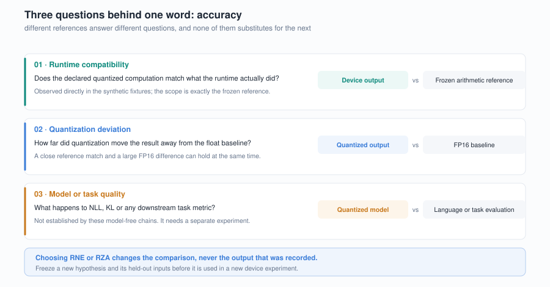
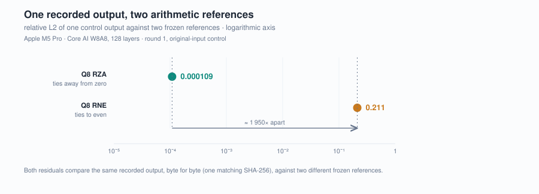
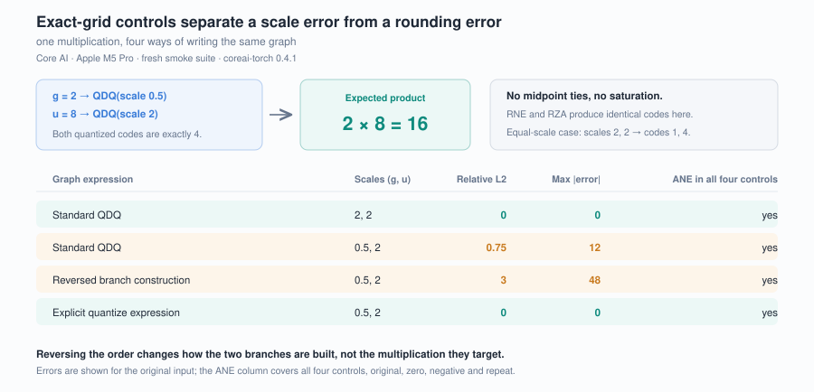

# ANE arithmetic compatibility: rounding, scale errors and model quality

English | [中文](zh/03-ANE算术兼容性.md)

Article draft · 2026-09-10 · [Series index](README.md)

**Numerical validation on ANE starts with an explicit reference.** Our experiments encountered two distinct kinds of discrepancy: one explained by a specific rounding rule, and another present even on exact-grid inputs with no rounding ambiguity. Calling both “A8 precision loss” obscures what needs fixing and how to test it.

This article uses the repository's convolution chains, QDQ multiplication and grouped-weight probes to explain how to build a checkable arithmetic reference. The fresh runs use M5 Pro, macOS 27.0 build 26A428, Xcode 27.0, coreai-torch 0.4.1 / coreai-core 1.0.0b2 and coremltools 9.0. Historical diagnostics are identified separately.

## 1. Every L2 value depends on a reference

We use relative L2 as follows:

```text
relative_L2(actual, reference) = ||actual − reference||₂ / ||reference||₂
```

It measures the relative distance between tensors, not the fraction of incorrect elements or a token error rate. A zero reference needs a separate check: the suite requires numerically zero output for its zero-input control without relying on this denominator.

Quantization studies involve at least three comparisons. Comparing a quantized graph's output with its arithmetic reference tests whether execution matches the declared computation. Comparing quantized output with FP16 measures how much quantization changes the values. Evaluating NLL, KL or task metrics measures model behavior. The first two can help explain the third, but cannot replace it.

The arithmetic reference must also specify intermediate precision and rounding boundaries. FP32 accumulation followed by FP16 conversion, FP16 conversion of each partial sum and an intermediate Q8 step can produce different finite-precision results from the same real-valued matrix formula. The repository's [reference implementation](../src/ane_scope/references/prepare.py) makes these steps explicit. [Methods](../docs/METHODS.md).



Figure 1. The three questions need separate validation. Changing a reference changes the comparison and its interpretation, not the recorded device output.

## 2. A midpoint rule can change a long chain's output

Consider symmetric Q8 with zero point 0 and scale 0.125. Quantization divides `x` by the scale, rounds to an integer and clamps to the INT8 range. At exact midpoints, two nearest-rounding rules can disagree:

| Input x | x / scale | Ties to even: RNE | Ties away from zero: RZA |
|---:|---:|---:|---:|
| 0.0625 | 0.5 | 0 | 1 |
| −0.0625 | −0.5 | 0 | −1 |
| 0.1875 | 1.5 | 2 | 2 |

RZA here means rounding to the nearest value, choosing the value farther from zero at a tie. It does not mean truncation toward zero. Both rules use the same INT8 width and scale; only midpoint handling changes. Once the result enters another convolution and quantization step, that difference can propagate through a long chain.

In the first historical 128-layer W8A8 control, relative L2 against the frozen RNE reference was approximately **0.232654**, so the candidate did not enter timing. Offline diagnosis then compared the same device output with a reference that preserved the FP16 boundaries and changed only the Q8 midpoint rule. Against RZA, the difference was approximately **0.000091523**.

**The device output was unchanged; the new arithmetic hypothesis predicted it more closely.** Selecting a reference after seeing the output does not by itself validate a new admission rule. The original run remains a failure. A subsequent experiment first froze new inputs with seed 20260912, both RNE and RZA references and the existing thresholds, then ran the held-out inputs. [Historical arithmetic evidence and source hashes](../results/historical/arithmetic-reference-evidence.json).

The held-out result supported that explanation. The repository's [fresh full-shape records](../results/fresh/throughput.json) also contain both comparisons:

| The same 128-layer W8A8 output | Relative L2 |
|---|---:|
| Against the preselected Q8 RZA reference | 0.000109 |
| Against the Q8 RNE diagnostic reference | 0.211 |

These values come from the fresh Core ML and Core AI records. Core AI A8W4 has the same comparison results. The `numerical.comparisons` and `RNE-not-gate.comparisons` fields in [`throughput.json`](../results/fresh/throughput.json) identify the same output hash. The RNE reference is diagnostic and does not determine admission.

This supports the reference model on the tested path, not RZA for all ANE arithmetic. The chain reference still uses RNE for FP16 conversion, while SplitConv partial sums and additions use a separately frozen FP16 RZA reference. Relative L2 against the RZA chain reference still has a residual of 0.000109. [Reference boundaries](../docs/METHODS.md).

A later single-QDQ probe covers every input rather than one chain. Fed all 63,488 finite FP16 values at unit scale, the Core AI QDQ on ANE matched ties-away-from-zero for every value; ties-to-even would have differed at 128 of them, the half-integers such as ±0.5 and ±2.5. [Imported counts](../results/historical/g1w-e4b-mobile-qat/evidence.json).



Figure 2. The horizontal axis is logarithmic. Both points use the first fresh process's original-input output, with matching hashes. They compare references; they do not measure a before/after change in performance or quality. [Source fields](../docs/figures/manifest.json).

## 3. Matching a quantized reference can coexist with a large FP16 difference

The historical held-out experiment also compared final W8A8 and FP16 outputs. Their relative L2 was approximately **0.68**, using the FP16 output norm as the denominator. This is compatible with a quantized output being close to its own RZA reference: one comparison tests the quantized computation, while the other measures its difference from FP16. [Source and denominator definition](../results/historical/arithmetic-reference-evidence.json).

The 35 T ops/s positive control thus establishes a fast path that passes controls under declared quantization semantics. The 128-layer low-entropy synthetic chain contains no language task, attention, KV cache or vocabulary output. Its L2 value cannot be interpreted as a percentage loss of language ability.

Runtime-compatibility and model-quality thresholds therefore serve separate purposes. Revising an arithmetic explanation does not change existing KL, NLL or real-MLP quality results. A more accurate reference helps determine whether the next investigation should target execution or the quantization recipe.

## 4. Exact-grid multiplication exposes a different problem

To remove midpoint ambiguity, a smaller probe uses `g = 2` and `u = 8`, with intended output `g × u = 16`. Each input passes through quantization and dequantization before multiplication.

With scales 0.5 and 2, both quotients are exactly 4. The integer codes are away from saturation and from half-integer midpoints; dequantization should recover 2 and 8. The equal-scale control uses 2 and 2, giving exactly representable quotients 1 and 4. RNE and RZA produce the same codes for these inputs.

The fresh suite runs original, zero, negative and repeat controls for each expression. Original-input results are:

| Core AI expression | Input scales | L2 against exact reference | Maximum absolute difference | ANE requests in all four controls |
|---|---|---:|---:|---|
| `equal` | 2, 2 | 0 | 0 | Yes |
| `unequal` | 0.5, 2 | 0.75 | 12 | Yes |
| `reverse_order` | 0.5, 2 | 3.0 | 48 | Yes |
| `explicit_q` | 0.5, 2 | 0 | 0 | Yes |

`reverse_order` changes the construction order of the two QDQ branches, keeping the intended `g × u` computation. `explicit_q` expresses quantization as explicit divide, round, clamp and integer-conversion operations, while retaining dequantization. Its controls pass in this minimal case, showing that a different expression can avoid the error. Broader input coverage and performance costs were not tested here. [Graph generation](../src/ane_scope/_coreai.py) and [four measured cases](../results/fresh/smoke.json).

The results narrow the discrepancy to particular expressions and execution paths. Q8 midpoint rounding cannot explain it. Sensitivity to branch construction order motivates investigating compiler transformations and scale handling, but without an internal trace we cannot identify a specific implementation that reused the wrong parameter.

A later probe gives the error a value-level rule. The `unequal` and `reverse_order` outputs are all-equal arrays whose recorded hashes identify them as 4 and 64. Each equals the two codes, both 4, dequantized with a single branch's scale: 0.5 when `g` is built first, 2 when `u` is. A second model-free probe computes `Q_out(a × Q_1/16(b))` on an all-ones input and returns 1, 2, 4 and 8 as the output scale rises from 1/16 to 1/2, which is `b`'s code dequantized with the output scale. Clamping the product to the output QDQ's range restores 1 in every arm. One substitution, a branch dequantized with another QDQ's scale, predicts every wrong value in both probes. It is still inferred from outputs. [The finding](../findings/coreai-qdq-multiply-scale/) adds a released QAT checkpoint that triggers it, and the limits of both rewrites.

ANE requests establish participation in these calls, not which physical unit produced the error. Historical isolated 0.4.1/0.4.2 comparisons are in the [version matrix](../results/historical/quantization-expected-results.json) and [provenance](../results/historical/quantization-provenance.json). The fresh suite tested only 0.4.1.



Figure 3. Error columns show only the original input; the ANE column requires requests in all four controls. These inputs have no midpoint or saturation ambiguity.

## 5. Grouped weights test a specific scale hypothesis

A second minimal probe uses 64 output channels, K64, two K32 scales per row and an identity-matrix input. Each output value selects a single weight, avoiding long-dot-product accumulation error in the weight interpretation.

In the fresh native Core AI K64 graph, persisted four-bit indices, the lookup table, two-dimensional scales and connections pass static audit. Yet **1921 / 4096** output values differ from the intended reference, with relative L2 **0.450247**. The output matches a separately generated error prediction: flatten the two-dimensional scale array, then incorrectly use its first 64 values as one scale per row. The K32 split control has zero numerical difference from the intended reference. [Controls and error-prediction comparison](../results/fresh/smoke.json).

This gives a hypothesis that predicts each wrong value and a correct control. Agreement with the flattened-scale model does not reveal the internal implementation. Core ML uses a different direct-INT4 representation; its native K64 output is correct but selects CPU in this test, so it does not demonstrate an ANE fix for the Core AI behavior. The [second article](02-group-quantization-and-split.md) connects grouped representations with device selection.

## 6. Make arithmetic claims reproducible

Check the bundled tables and records without a device:

```sh
.venv/bin/python scripts/summarize.py
.venv/bin/python results/historical/tests/verify_historical.py
.venv/bin/python -m unittest discover -s tests -v
```

The first command checks fresh measurement tables and registered document values. The second checks historical throughput records. The third covers portable checks including rounding midpoints, saturation and damaged evidence. None reruns ANE. The historical arithmetic excerpt also records source files, fields and hashes for reviewing the original diagnosis.

In a [supported local environment](../docs/REPRODUCING.md), run device controls into a new output directory:

```sh
.venv/bin/ane-scope run --suite compatibility --output runs/article-arithmetic
.venv/bin/ane-scope verify runs/article-arithmetic
.venv/bin/ane-scope report runs/article-arithmetic
```

This suite runs the grouped and multiplication controls. To obtain a new 128-layer RNE/RZA comparison, use `--suite throughput` with another new output directory; it includes the full timing experiment. Execution is serial and resource-guarded.

If a future runtime fixes these behaviors, record the correct outputs as new observations. Existing errors are not results the suite must preserve in future runs. Freeze reference semantics before obtaining new device outputs; if those semantics change, register a new version and validation input while preserving the original failure. This distinguishes changes to device output, reference interpretation and the model itself.

The later [G2 service study](04-w4a16-service-tradeoffs.md) measures W4A16 component speed, thermal response and GPU coexistence as a separate experiment.
