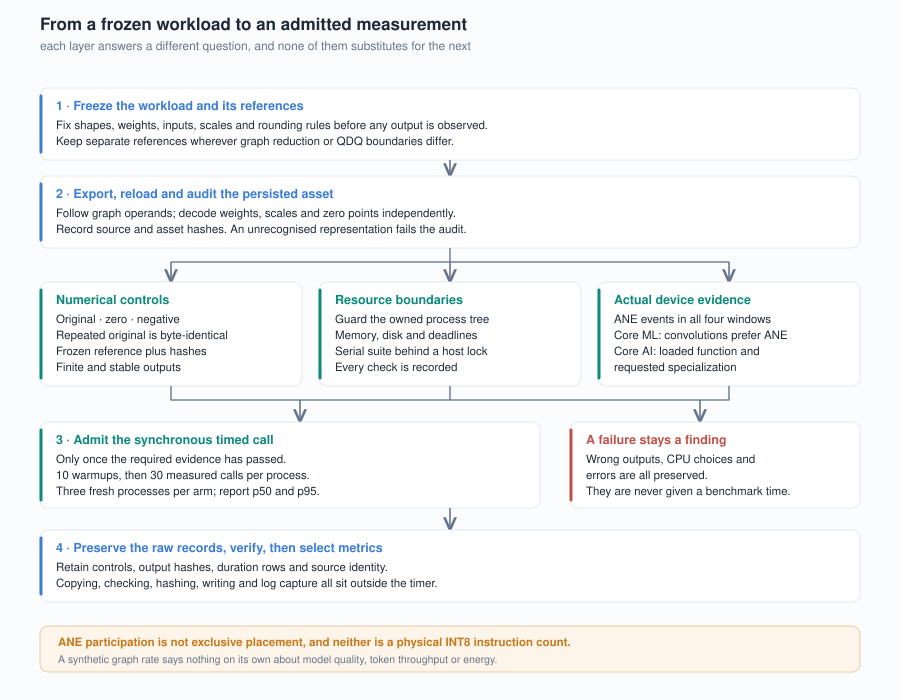
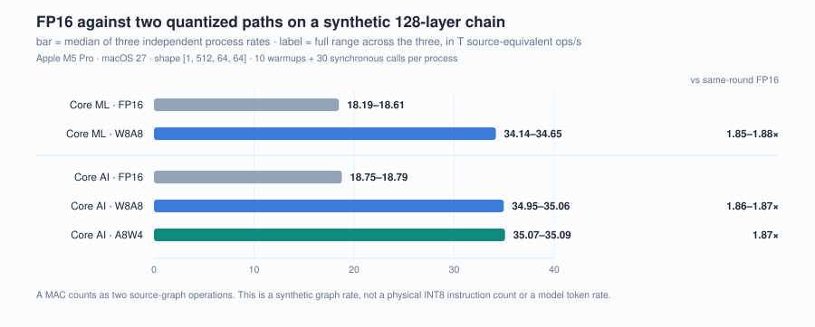

# 如何验证 ANE 的量化加速：从图表示到 35 T ops/s 正对照

[English](../01-measuring-ane-performance.md) | 中文

研究文章初稿 · 2026-09-10 · [系列索引](README.md)

## 摘要

本文介绍一套面向 Apple 运行时的 ANE 量化加速验证方法。核心思想是把图的持久化表示、数值正确性、编译计划、首选设备、控制窗口中的 ANE 参与和计时结果分成独立证据层。一个合成的 128 层卷积链在 M5 Pro 上达到约 35 T ops/s 的源图等效吞吐。实测支持这条量化图路径获得加速；逐算子执行位置、物理指令和模型收益尚未证实。

## 1. 从被测工作解释速度

这个实验使用固定形状 `[1,512,64,64]` 的 128 层卷积链。每层是 512×512 的 1×1 卷积，空间位置数是 4096，因此源图工作量定义为

`2 × depth × 512² × 4096`

其中前面的 2 是 MAC 按两次运算计数（乘和加），不是设备指令数。depth=128 时，工作量为 274,877,906,944 次源图等效运算，即约 0.2749 T operations；depth=2 时为 4,294,967,296 次。报告里的 T ops/s 是上述工作量除以同步预测的 p50 时间（秒），再除以 10¹²。例如 274,877,906,944 次源操作除以约 7.84 ms，得到约 35.06 T ops/s。这里的分子只按源卷积计算；QDQ、切片或归约等图操作的成本仍包含在同步预测时间中。它回答的是“这张合成源图以多快完成”，不能直接改写成模型 token/s。

权重来自 Hadamard 矩阵、逐层置换和符号翻转，权重初值相同且可由种子重建；每个权重代码实际只取 ±1，再乘共同尺度，这并没有覆盖四位权重的全部代码或真实分组尺度分布；输入只有 16 个独立空间向量，随后重复到 4096 个位置。这能让参考计算和字节级重复性检查稳定，却不是高熵 LLM 激活分布。方法、量化边界和限制见 [实验方法](../../docs/METHODS.md)。

## 2. 各种量化表示对应各自的数值参考

FP16、W8A8 和 A8W4 在这个合成数据中从相同的初始权值出发，但 W8A8 和 A8W4 在层间插入激活 QDQ，所以它们不是质量等价的三个模型。FP16 参考用 FP32 累加并在边界转 binary16；量化参考使用声明的尺度、binary16 中间边界以及 Q8 最近舍入（ties away from zero，RZA）。另存的 ties-to-even（RNE）参考只用于识别舍入规则差异，不替换准入参考。

因此，W8A8 与 A8W4 的速度接近，只能说明在这套合成控制下吞吐接近，不能推出任意真实权重都同样快或量化质量相同。分割实验还改变了 K 维切片、FP16 加法树和舍入边界，宽路径与 split32 因此使用各自冻结的参考。



图 1：数值错误、CPU 选择和证据不足的配置记为观测，不进入性能比较。图中流程对应当前套件。

## 3. 四个控制把“算对了”变成可检查的条件

每个独立进程先执行四个控制：原始输入、全零输入、符号取反输入和原始输入重复。线性卷积链和分组探针预期输出随输入取反；乘法探针预期保持不变。每个输出都保存并哈希。重复原始输出必须逐字节相同，全零输出必须逐元素为零；所有控制要求有限输出，采用相对 L2 门槛的非零正负控制还要求非零比例至少 25%。depth=2 的链使用相对 L2 阈值 0.01，depth=128 使用 0.05；精确网格的分组和乘法探针要求零数值差异。

这些控制能够排查零输出、符号错误、重复不稳定等失效方式，但不等于穷尽所有输入的正确性。例如 Core AI 的 group-native64 在 smoke 结果中 ANE 参与为真，但数值控制为假，不能进入计时；Core ML 两个 group 资产数值为真，却选择 CPU。

## 4. 图表示和持久化资产要独立审计

审计对象是持久化后的资产。Core ML 资产从保存后的 protobuf 和 weight blob 重新加载，沿着 conv、QDQ、slice、add 的输入依赖检查连接，确认每个卷积实际读取哪份权重和中间结果，并独立解码权重、尺度、zero point 和 INT4 数据。Core AI 资产则从保存的 bytecode 读取，独立检查 INT8 权重或四位 palette 索引。未知或被优化器折叠成不明表示的资产无法通过审计。

这一步区分了“图中请求了低比特”与“保存后的模型确实包含可识别的低比特表示”。它也能捕捉 group 的两种前端表达：Core ML 使用直接 signed INT4 blockwise scaling，Core AI 使用四位索引、INT8 LUT 和尺度。两者语义探针相同不代表序列化格式或设备内核相同。资产审计还记录每个文件的相对路径和 SHA-256，供后续核对。

## 5. 编译计划、首选设备和 ANE 参与是三件事

Core ML 主机保存模型描述和 compute plan；计划可以告诉我们某个操作支持哪些设备、首选设备是什么。控制窗口另行捕获目标进程的统一日志，并要求每个控制时间窗出现成功的 ANE 请求。Core AI 主机请求 Neural Engine specialization，同时记录实际加载的函数身份和控制窗口参与，但当前接口没有每操作映射证明。

这些证据回答不同问题。序列化的 `conv` 或 `constexpr` 只说明图表示；preferred device 只说明编译器计划的倾向；日志中的 ANE 请求说明控制窗口有 ANE 参与；它们都不等于每个算子全程在 ANE，也不等于物理 INT8 指令。请求 `.cpuAndNeuralEngine` 或使用四位权重也不足以证明纯 ANE 执行或硬件整数算术。报告因此将 serialized、numeric、plan、preferred、ANE participation 和 physical INT8 分栏呈现。

## 6. 35 T ops/s 正对照说明什么

新吞吐实验在 Apple M5 Pro、macOS 27.0 build 26A428、Xcode 27.0、coremltools 9.0、coreai-torch 0.4.1 / coreai-core 1.0.0b2 环境中，对每个配置各运行三个独立进程。每个进程在四项控制后执行 10 次暖机和 30 次同步测量；三轮中，各配置的执行顺序为正向、反向、正向。原始结果见 [throughput.json](../../results/fresh/throughput.json)。

| 配置 | p50 范围（ms） | 源图等效吞吐（T ops/s） |
|---|---:|---:|
| Core ML FP16 128 | 14.768–15.115 | 18.19–18.61 |
| Core ML W8A8 128 | 7.934–8.052 | 34.14–34.65 |
| Core AI FP16 128 | 14.631–14.662 | 18.75–18.79 |
| Core AI W8A8 128 | 7.839–7.865 | 34.95–35.06 |
| Core AI A8W4 128 | 7.833–7.837 | 35.07–35.09 |

计时区间是 Swift 同步预测／函数运行，包括该调用内的运行时、等待和同步成本。输出复制、校验、哈希和文件写入在区间外，统一日志采集在四项控制完成后停止，不参与暖机和测速。因此这个口径也不能称作纯内核执行时间。

所以“约 35 T ops/s”是 Core AI W8A8/A8W4 在该源图计数口径下由各进程 p50 换算的结果，最高进程中 A8W4 为 35.09 T ops/s。它是正对照：FP16 大约 18.8 T ops/s，量化链大约 35 T ops/s，同轮配对中量化链的速度约为 FP16 的 1.86–1.87×。它不是通用 ANE 峰值声明，也不是完整模型性能结论。这个速率和这个比值既属于格式，也属于这个 fixture。形状不变时，含 <!-- claim:g1w.weights.zero-fraction@g1w-001 -->73.63%<!-- /claim --> 精确零的权重让 FP16 本身快 <!-- claim:g1w.density.old.speed@g1w-002 -->1.88×<!-- /claim -->，A8W4 相对 FP16 的收益也从 <!-- claim:g1w.codebook.old.a8-over-fp16@g1w-003 -->1.89×<!-- /claim --> 降到 <!-- claim:g1w.codebook.full.a8-over-fp16@g1w-004 -->1.36×<!-- /claim -->；层数减少时收益同样缩小，单层 A8W4 只有 W4A16 速度的 <!-- claim:g1w.depth.both-1.speed@g1w-005 -->0.86×<!-- /claim -->。[加速条件](../../findings/quantized-speedup-conditions/)。30 个样本属于同一进程内的相关观测，三个进程的范围也不是置信区间。



图 2：条形长度是三个独立进程速率的中位数，标签给出三者的完整范围，不是置信区间。吞吐按源操作数除以各进程 p50 计算；右侧的配对比值表示量化路径相对同轮 FP16 的速度。数据与精确字段见[图表来源清单](../../docs/figures/manifest.json)。

## 7. 如何复现与重算

在 Apple 主机上按项目锁定环境执行：

```sh
uv sync --locked --extra apple
.venv/bin/ane-scope run --suite throughput --output runs/my-throughput
.venv/bin/ane-scope verify runs/my-throughput
.venv/bin/ane-scope report runs/my-throughput
```

命令要求新的输出目录。导出、编译、宿主执行或证据损坏会记录执行失败；数值或设备准入不通过则保留为观察结果，并跳过对应候选的测速。检查 `manifest.json`、每个进程的 `admission.json` 和测量数量，退出码不足以判断所有配置都成功加速。运行前应核对机器、OS、SDK、依赖版本和源码身份；保存的源码快照、数据和资产哈希用于确定本次运行的身份。没有设备时，可用标准库读取结果 JSON，按 `source_ops / (p50_ms × 10^9)` 重算 T ops/s，检查三个进程范围和配对比值。这只验证算术，不提供设备参与或物理 INT8 证据。

实际安装条件、离线缓存方法与资源限制见[复现指南](../../docs/REPRODUCING.md)。运行程序不会自动下载模型。无需执行设备代码即可检查随仓库的表格：

```sh
.venv/bin/python scripts/summarize.py
.venv/bin/python results/historical/tests/verify_historical.py
```

这个正对照为后续实验提供了比较起点。如何保留量化精度、选择可执行图并控制拆分成本，是[下一篇文章](02-分组量化如何改变ANE的执行图.md)讨论的问题。

后续的 [G2 服务实验](04-W4A16留在ANE上值得吗.md)记录 W4A16 的组件速度、热响应和 GPU 共存，不改变本文结论。
