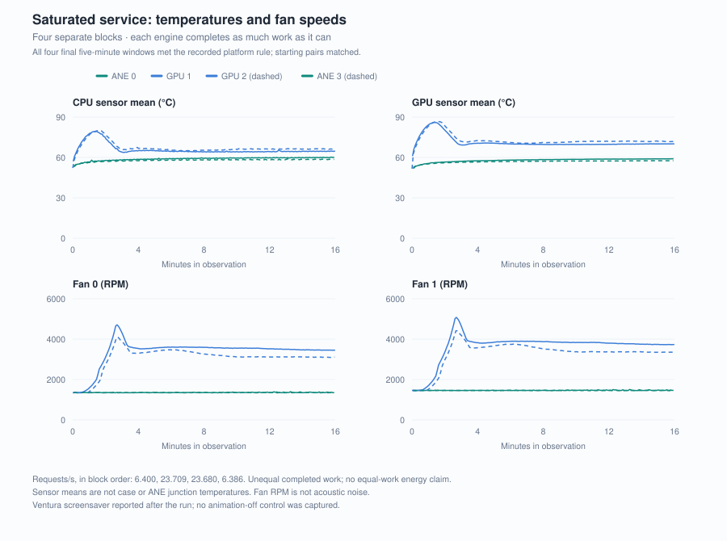
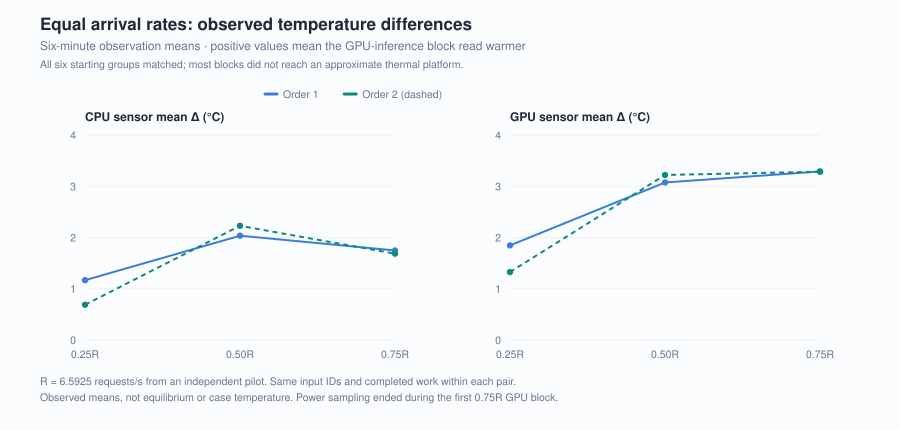
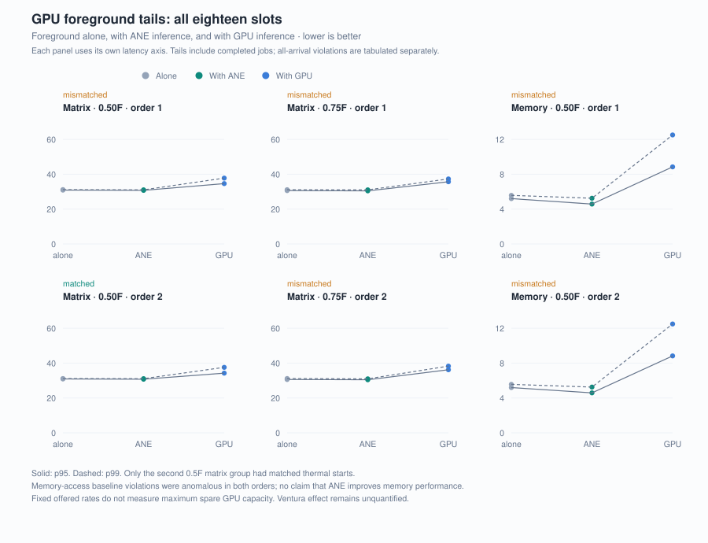

# W4A16 留在 ANE 上值得吗：速度、热行为与 GPU 共存

[English](../04-w4a16-service-tradeoffs.md) | 中文

完整模型的 prefill、decode 与组件能量另见[第五篇：Qwen3-4B FP16](05-Qwen3-4B的Prefill、Decode与能耗.md)。本篇讨论 G2 的 W4A16 组件运行。

2026-09-11 · [系列索引](README.md)

## 摘要

ANE 不必成为最快的推理设备才有使用价值。如果较慢的服务仍满足需求，同时减少持续热负担、给前台 GPU 工作留下空间，这种交换就值得测量。G2 对同源 Q4_0 权重的第一层完整 MLP 进行了七档速度、固定到达率、满负载和 GPU 共存实验。在 M5 Pro 上，ANE 的速度约为 GPU 的四分之一；相同负载下两侧风扇都停在怠速，GPU 传感器读数高几度，风扇只在 GPU 满负载时升高。原生宿主在有限运行中没有出现 Python 路径的每调用内存增长，前台矩阵计算任务出现较小尾延迟干扰的信号。功率记录未通过完整性与时钟规则，能耗未判定；动态屏保，以及部分配对测试开始时温度和风扇状态的差异，也限制了归因。本轮推进的是组件级服务比较，尚未建立完整 LLM 的实际收益。

## 1. 速度、热负担与前台体验需要分别回答

前三篇文章讨论量化图怎样获得加速，以及表示、拆分和算术兼容性怎样影响这条路径。G2 把问题推进到持续服务：当前 W4A16 实现能处理多少工作，它运行时设备如何升温，前台 GPU 任务又会受到什么影响？

这三个答案可能并不一致。较低瞬时功率不保证较低总能量；较慢但持续温和的负载仍可能适合个人电脑。另一方面，温度较低也可能来自完成工作更少。实验因此包含两种比较：两侧以各自能力持续处理请求，以及两侧接收相同到达序列、完成相同输入工作。GPU 共存再加入前台独占基线，并记录推理服务是否按时完成。

## 2. 工作负载与执行路径

工作负载固定为 Gemma 4 12B 第一层完整 MLP：gate、up、GELU_tanh／乘积分支和 down，H=3840、I=15360。两侧使用同源 Q4_0 权重和 FP16 输入输出；ANE 走原生 Swift Core AI 宿主，GPU 走 MLX。N 是一次请求中的 MLP 位置数。N<256 时 ANE 使用 tile64，其余使用 tile256，GPU 一次处理整请求。三份保存的激活轮换使用，部分较大形状由已有激活重复构成。

七档为 64、128、256、512、1024、2048、4096。每侧三个新宿主，每单元包含五次控制、十次暖机和三十次计时；另有同尺寸的 tile 诊断，共 45 个单元。同权重不是两后端输出逐字节相等的要求：先按各自在实验前固定的数值参考检查两侧输出，通过后再比较速度。完整的[方法](../../docs/METHODS.md#g2-component-service-protocol)、[计量边界](../../docs/SCOPE.md#g2-service-observations)和[来源](../../docs/PROVENANCE.md#g2-native-w4a16-service)与结果一起保存。

## 3. 速度曲线说明当前实现的服务能力


图 1：三个宿主是独立重复单位，同一宿主的三十次调用没有被当作三十次独立实验。GPU 在 N512 有一轮较慢。横轴按 log₂ 间距排列，单位始终是 MLP 位置。

N1024 的宿主中位速率为 ANE 约 **6,760 位置/s**、GPU 约 **27,300 位置/s**，ANE 为 GPU 的 **0.248×**。ANE 在 N256 以上约为每秒 6,751–6,764 位置，说明这套固定 tile 调度在这些请求长度下的吞吐相近。它不能直接回答更大融合图是否会更快。

同一原生宿主内的 N1024 tile 配对给出了更局部的证据：tile256 相对 tile64 的吞吐比为 **1.075–1.081×**。这个收益属于本轮同尺寸诊断。此前 Python 和原生单进程记录未与本轮合并，不能把不同轮次的差值全部归因于某一次代码修改。

满负载服务的计时口径更宽：它包含请求间的输出校验、哈希、日志与周期性内存预测。四块墙钟吞吐分别为 ANE **6.400／6.386 请求/s**（均值 6.4）、GPU **23.709／23.680 请求/s**（均值 23.7），ANE 两块均值约为 GPU 的 **0.270×**。这个比例高于客户端计时的 0.248×：每个请求之后两侧执行相同的校验与记录步骤，在更快的 GPU 工作中占比更大。客户端计时与墙钟服务吞吐的差异不能直接解释成设备降频；原分析另存逐请求时间分区，公开重算保留实际完成时间，不扣除估计开销。

## 4. 满负载更凉，与相同服务负载更凉



图 2：每块观察十六分钟，四块按运行顺序排列。两组配对测试的起始温度和风扇状态匹配，尾五分钟均满足事先记录的近似平台规则。GPU 完成的请求更多，因此图中的差异不能用来证明同工作量能量更少。

ANE 块尾五分钟的 GPU 传感器均温读数中位数约为 **57.5–58.8°C**，GPU 块约为 **70.0–72.0°C**；风扇转速也明显不同。传感器读数不是机身表面温度，风扇转速也不是声压；本轮没有测量机壳温度或噪声。

相同到达率实验使用独立 pilot 得到的较慢侧服务率 R，在 0.25R、0.5R、0.75R 三档各做两轮配对。两侧共 **14,244** 个请求全部在软截止时间内完成，六组配对测试的起始温度和风扇状态都匹配。



图 3：六分钟观察窗内，GPU 传感器均温差为 **1.33–3.29°C**，小于满负载比较的差异。两种比较的工作量条件不同，各自的温差对应各自的负载。多数块未达到近似平台；第一轮 0.75R GPU 块中功率采集退出，观察器开销随之改变。

两种比较里还有一个不对称：温度读数不同，风扇却没有。六组同到达率配对中，最高 **4.9 请求/s**，两侧风扇均值都停在块起始的怠速附近（风扇 0 约 **1,350 RPM**），差值只有几 RPM；GPU 传感器却高 **1.3–3.3 °C**。风扇只在满负载块中分开：ANE 以 **6.4 请求/s** 运行时仍在怠速，GPU 以 **23.7 请求/s** 运行时风扇 0 为 **3,100–3,500 RPM**。这些块不能证明相同工作量下的风扇优势：完成速率与执行路径同时变化，两者的贡献尚未分离。GPU 在 4.9 到 23.7 请求/s 之间没有测量，它的风扇从哪个负载开始升高仍然未知。


图 4：左为 GPU 传感器均温，右为风扇 0 转速；同到达率点为六分钟均值，满负载点为尾五分钟中位数。灰色区间是 GPU 未测量的负载范围，虚线为块起始风扇 0 中位数，风扇 1 的数值在图注中给出，行为相同。

## 5. GPU 共存的尾延迟与基线

前台使用固定矩阵和固定内存访问两类 GPU 工作。每类先测自己的独立容量，再提供固定比例的到达负载。每组包含前台独占、与 ANE 推理同跑、与 GPU 推理同跑。两侧推理到达率相同，前台延迟的差异不来自某一侧少处理请求。



图 5：各面板使用自己的毫秒纵轴；实线为 p95，虚线为 p99。分位数基于已完成工作，超过软截止时间的请求比例另以全部到达的请求为分母。完整计数见[测量表](../../docs/MEASUREMENTS.md)。

只有第二轮 0.5F 矩阵组的起始温度和风扇状态匹配。它的前台 p95 为独占 **30.921 ms**、ANE 同跑 **30.771 ms**、GPU 同跑 **34.248 ms**。ANE 同跑接近基线，而 GPU 同跑的尾延迟更高。其余矩阵组方向相近，但起始温度和风扇状态不同，限制了归因。推理侧十二个共存流各有 792 个请求，全部在软截止时间内完成。

四组前台矩阵计算任务都有同一个模式，两种顺序下都成立。GPU 同跑的前台 p95 比独占高 **3.3–5.6 ms**；ANE 同跑却比独占低 **0.144–0.151 ms**，四组几乎一致。多一个负载不应让前台更快，所以“独占”不是零干扰基线。一个待检验的解释是：只有轻量前台时，SoC 可能停在较低的性能状态，任何第二个负载都会把它抬高；加一个只占 CPU 的忙等对照可以区分这种效应与真实干扰。GPU 同跑的代价是这个偏移的二十倍以上，所以它的方向比单个匹配组更稳；幅度仍受动态屏保影响——若动画使用 GPU，同时服务前台与推理的 GPU 多出这第三个用户，损失可能大于只服务前台时。

内存访问前台两轮独占基线中，超过软截止时间的请求比例为 **13.50%／13.37%**，ANE 同跑为 **5.75%／5.83%**，GPU 同跑为 **12.36%／12.34%**；GPU 同跑的尾延迟又较高。两轮基线都需要排查，不能解释为 ANE 改善了内存性能。固定到达率下吞吐保留率接近 1，也只能说明该负载被处理，无法确定剩余 GPU 容量。

## 6. 个人电脑的后台负载与动态屏保

个人电脑运行时必然有系统后台负载，ANE 常驻组件要面对的正是这种条件，所以本轮在正常系统后台下测量。

运行中 Ventura 动态屏保自动加载，r4 的 775 次后台快照都有它的进程；进程在场不代表每个时隙都在渲染。它可能直接与 GPU 推理争用资源，也可能通过统一内存和热状态影响 ANE，两侧受到的影响不一定相同。本轮没有关闭动画的对照，因此没有估计或扣除它的开销。下一轮用 N1024 做静态与动态显示的交叉配对，检验速度和尾延迟对显示条件是否敏感。

## 7. 内存表现与待测问题

四个新 P0 宿主各完成 512 次 N4096 测量。两个原生 ANE 宿主各做了 **33,728** 次 stage 调用，结束时 footprint 反而比开始小 **60–62 MiB**；如果它们像历史 Python 路径那样每次 gate 调用保留一个输出缓冲区，仅 gate 调用就会增加约 **61.8 GiB**。宿主、流水线、tile 尺寸与运行都不同，所以这不是绑定层的 A/B 对照，但说明每调用增长不是所有入口的共同属性。r4 设备段的 23,183 个资源样本中，组件 footprint 峰值 **2.928 GiB**，全部自有进程 RSS 峰值 **2.419 GiB**，swap 没有观察到增长。共存阶段 RSS 反复升起再回落的是内存访问前台，不是推理宿主；组件峰值出现在 P2，而 P0 同为 N4096 时 MLX 宿主结束于 1.55–2.32 GiB、原生 ANE 宿主结束于 536 MiB。这些是有限运行，不等于完整模型常驻或无限运行；历史 Python 路径也未修复。

G2 能耗未判定。功率接收器触及 1 GiB 容量上限，完整流还有截断尾部和不满足原时钟规则的问题。六个同工作量能耗比较均保持未判定。**更正（2026-09-11）：**此前将不可信的系统功率读数归因于 SMC，但采样器在这一列混合了 SMC 与组件功率估计，不能据此判定 SMC 故障，也不能用它替代失败的能耗测量。[功率测量范围](../../docs/SCOPE.md#g2-service-observations)。

G2 的贡献是把服务吞吐、热响应和前台干扰放进同一个有明确工作量的记录中。它支持继续研究 W4A16 的使用价值，尚不支持把这层 MLP 的结果推广到整模型、iPhone 或其他 Apple 芯片。A8W4 保留为暂停的 Open Question，本轮没有改变它的数值问题或恢复条件。

## 8. 读者可以检查什么

```sh
python scripts/verify_g2.py
python scripts/summarize.py
python scripts/render_figures.py --check
```

[公开证据包](../../results/historical/g2-w4a16-night/)保留每个请求事件的必要标量、传感器与内存样本、自然检查点和来源身份。离线检查可以重算本文表格与曲线；它不重新执行原工作区的全部设备／资产审计。完整原始复核与设备重跑仍需未随仓库分发的资产和 G2 控制器，三种复现层次在[复现指南](../../docs/REPRODUCING.md#g2-recomputation-and-device-replay)中分别说明。