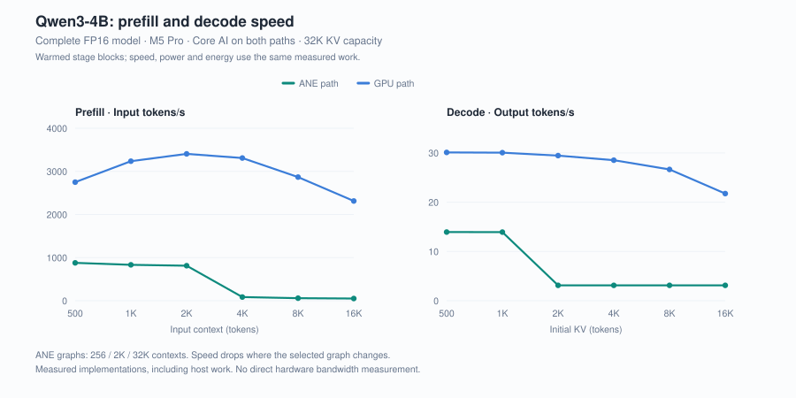
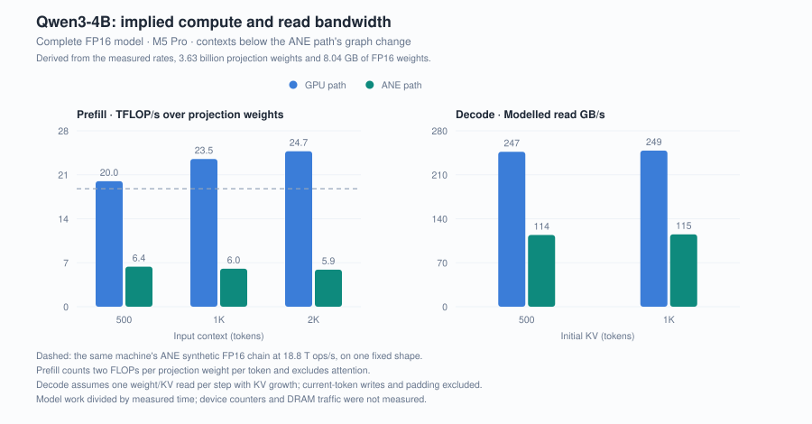
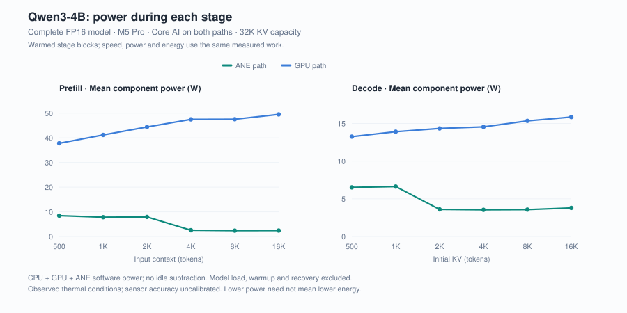
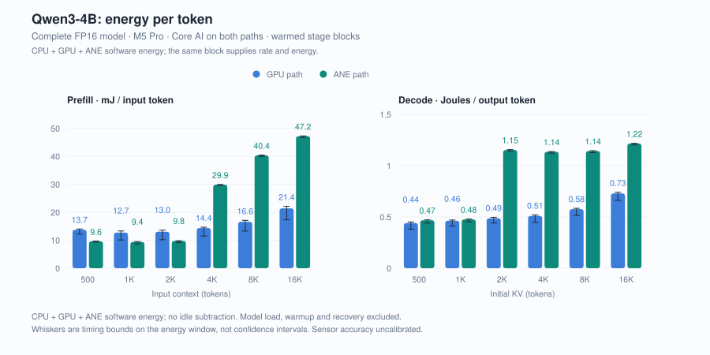
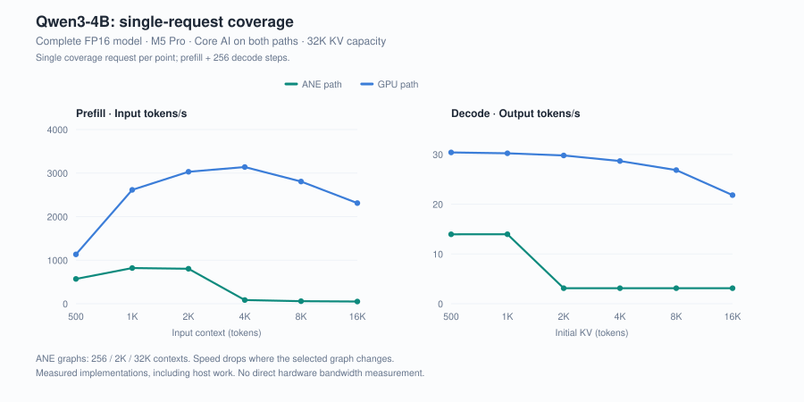
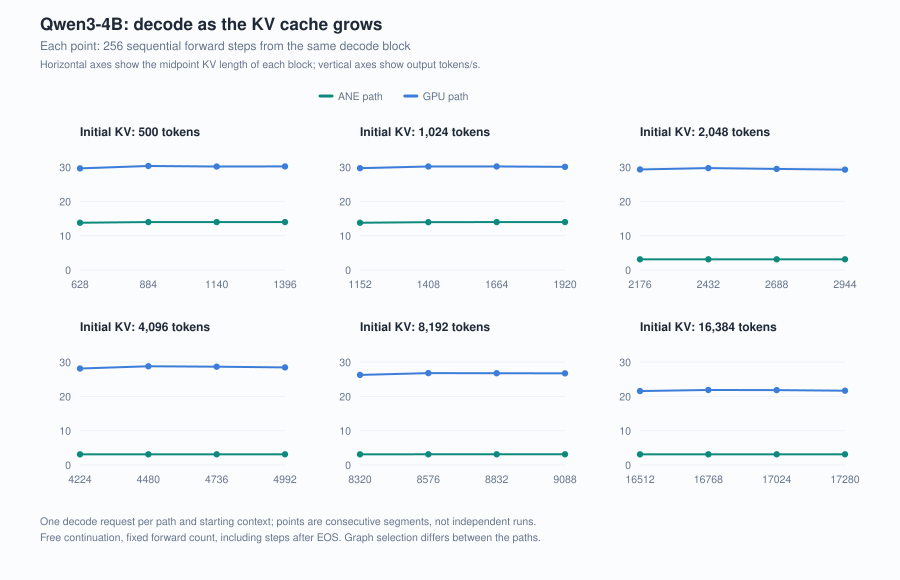

# Qwen3-4B 在 ANE 上的 Prefill、Decode 与能耗

[English](../05-qwen3-4b-prefill-decode-energy.md) | 中文

早期 W4A16 实验测的是一个 MLP 组件。G3 将对照推进到完整 Qwen3-4B FP16 推理，包含 attention、KV 更新、层间传递与 token 采样。两侧都通过同一个 Swift 宿主使用 Core AI；ANE 使用固定形状引擎，GPU 使用顺序引擎。本轮 GPU 基线与 G2 的 MLX 宿主不同。

问题是每条路径完成工作有多快、需要多少能量。两侧各自以能够达到的速度运行。匹配一个较低的请求到达率，回答的是后台服务的另一个问题。

## 1. 测量的工作是什么

输入包含 <!-- claim:g3.contexts@g3-001 -->500 / 1,024 / 2,048 / 4,096 / 8,192 / 16,384<!-- /claim --> 个 token，来自固定快照中的本仓库研究文档。两侧使用相同的初始 token IDs、源权重、FP16 精度和 <!-- claim:g3.capacity@g3-002 -->32,768<!-- /claim --> 位置的 KV 容量。这是一台 M5 Pro 上的一组输入族。

G3 先在每档上下文、每条路径完成一次完整请求：prefill 后接 <!-- claim:g3.coverage-steps@g3-003 -->256<!-- /claim --> 次 decode 前向。随后单独测量预热后的 prefill 与 decode 连续块。主图使用后一组数据，以完成的输入或输出 token 数除以整个工作块的时长。块内请求分发、reset 和记录间隙都算在内；模型加载、单独预热和恢复阶段不算。

Prefill 重置缓存，并包含首 token 采样。Decode 从准备好的缓存开始，完成 <!-- claim:g3.decode-steps@g3-004 -->1,024<!-- /claim --> 次顺序前向；遇到 EOS 仍继续，以固定工作次数。续写内容由模型自由生成，因此相同前向次数不代表文字相同或任务质量相等。已记录的控制将首输出 logits 与独立 CPU FP16 参考对照，并检查短问答与缓存状态；这不是覆盖输入分布的质量评测。

## 2. Prefill 与 decode 在不同位置转折

<!-- claim:g3.n.1024@g3-005 -->1K<!-- /claim --> 时，ANE prefill 为 <!-- claim:g3.prefill.1024.ane-rate@g3-006 -->832.4 token/s<!-- /claim -->，GPU 为 <!-- claim:g3.prefill.1024.gpu-rate@g3-007 -->3,235.9 token/s<!-- /claim -->；GPU 快 <!-- claim:g3.prefill.1024.gpu-faster@g3-008 -->3.89×<!-- /claim -->。<!-- claim:g3.n.16384@g3-009 -->16K<!-- /claim --> 时，两侧分别为 <!-- claim:g3.prefill.16384.ane-rate@g3-010 -->50.9 token/s<!-- /claim --> 和 <!-- claim:g3.prefill.16384.gpu-rate@g3-011 -->2,312.7 token/s<!-- /claim -->。这不是随输入增长而逐渐下降的同一条平滑曲线。

ANE 的图包含 <!-- claim:g3.graph-contexts@g3-012 -->256 / 2K / 32K<!-- /claim --> 上下文。一个能装入较小图的 prompt，可能在下一步 decode 时越过容量边界。原始事件显示，从 <!-- claim:g3.n.2048@g3-013 -->2K<!-- /claim --> KV 开始的续写已使用更大的 extend 图，而 <!-- claim:g3.n.2048@g3-014 -->2K<!-- /claim --> prefill 仍能装入较小图；更长的 prefill 也会进入更大的 prompt 图。这使曲线转折能与具体函数选择对应，但尚未隔离各项编译器或运行时代价。

从 <!-- claim:g3.n.1024@g3-015 -->1K<!-- /claim --> KV 开始，ANE decode 为 <!-- claim:g3.decode.1024.ane-rate@g3-016 -->13.9 token/s<!-- /claim -->，GPU 为 <!-- claim:g3.decode.1024.gpu-rate@g3-017 -->30.0 token/s<!-- /claim -->。从 <!-- claim:g3.n.2048@g3-018 -->2K<!-- /claim --> 开始，ANE 为 <!-- claim:g3.decode.2048.ane-rate@g3-019 -->3.1 token/s<!-- /claim -->，GPU 为 <!-- claim:g3.decode.2048.gpu-rate@g3-020 -->29.4 token/s<!-- /claim -->。图和宿主路径的差异意味着，不能把这个速度差直接解读为两侧可用 UMA 带宽的差异。

token 速率可以换算成模型的有效工作速率。每个 prefill token 要过 <!-- claim:g3.projection-parameters-cn@g3-050 -->36.3 亿<!-- /claim --> 个投影权重，因此 ANE 在 <!-- claim:g3.n.1024@g3-052 -->1K<!-- /claim --> 为 <!-- claim:g3.prefill.1024.ane-tflops@g3-051 -->6.0 TFLOP/s<!-- /claim -->，在 <!-- claim:g3.short-contexts@g3-054 -->500–2K<!-- /claim --> 保持 <!-- claim:g3.short-prefill-ane-tflops@g3-053 -->5.9–6.4 TFLOP/s<!-- /claim -->，GPU 则为 <!-- claim:g3.prefill.1024.gpu-tflops@g3-055 -->23.5 TFLOP/s<!-- /claim -->。作为参照，同一台机器的 ANE 合成 FP16 卷积链在单一固定形状下约为 <!-- claim:g3.synthetic-fp16@g3-066 -->18.8 T 源图等效 ops/s<!-- /claim -->，与这里同样按每个 MAC 记两个 op；那是另一种图，不是硬件峰值。假设 decode 每步读取一次 <!-- claim:g3.weight-bytes@g3-056 -->8.04 GB<!-- /claim --> 的 FP16 权重与已有 KV，并累计缓存增长，模型推算 ANE 为 <!-- claim:g3.decode.1024.ane-bandwidth@g3-057 -->115 GB/s<!-- /claim -->，GPU 为 <!-- claim:g3.decode.1024.gpu-bandwidth@g3-058 -->249 GB/s<!-- /claim -->，而且 GPU 这个数字一直到 <!-- claim:g3.n.8192@g3-059 -->8K<!-- /claim --> 都大致保持这个水平。推算字节率大致平稳，与带宽主导的模型一致，但瓶颈尚未独立确认。ANE 的较低速率可能来自自身的访存限制、固定图重复工作或宿主开销，这些因素尚未分离。两个数字都是由实测 token 速率和模型结构换算的有效工作速率；字节模型不计当前 token 的写入和固定图填充，没有测量设备计数器或 DRAM 流量。

图容量是一个可检验的解释。假设一个查询位置计算 <!-- claim:g3.largest-graph@g3-060 -->32K<!-- /claim --> 图中的全部 key，其注意力工作量为 <!-- claim:g3.attention-flops-largest-graph@g3-061 -->19.3 GFLOP/token<!-- /claim -->，而投影为 <!-- claim:g3.projection-flops@g3-062 -->7.27 GFLOP/token<!-- /claim -->。这是该图在明确假设下的运算量；完整 prefill 请求会使用多个容量的图，编译器也可能跳过被 mask 的工作。实测 ANE prefill 从 <!-- claim:g3.n.2048@g3-063 -->2K<!-- /claim --> 到 <!-- claim:g3.n.4096@g3-064 -->4K<!-- /claim --> 下降了 <!-- claim:g3.prefill-drop@g3-065 -->9.6×<!-- /claim -->。这套运算计数不能判定实测下降中有多少来自图容量；文末的图形梯度实验可以检验这个解释。

## 3. 低功率与低能耗是两件事

<!-- claim:g3.n.1024@g3-021 -->1K<!-- /claim --> prefill 时，ANE 路径的 CPU＋GPU＋ANE 平均功率为 <!-- claim:g3.prefill.1024.ane-power@g3-022 -->7.83 W<!-- /claim -->，GPU 路径为 <!-- claim:g3.prefill.1024.gpu-power@g3-023 -->41.18 W<!-- /claim -->。每输入 token 的能量分别为 <!-- claim:g3.prefill.1024.ane-energy@g3-024 -->0.00941 J/token<!-- /claim --> 和 <!-- claim:g3.prefill.1024.gpu-energy@g3-025 -->0.01273 J/token<!-- /claim -->。在这组工作中，较慢的 ANE 路径确实消耗了较少的组件能量。

<!-- claim:g3.short-contexts@g3-026 -->500–2K<!-- /claim --> prefill 的 ANE 每输入 token 能量为 GPU 的 <!-- claim:g3.short-prefill-energy-x@g3-027 -->0.70–0.75×<!-- /claim -->；<!-- claim:g3.long-contexts@g3-028 -->4K–16K<!-- /claim --> 则为 <!-- claim:g3.long-prefill-energy-ratio@g3-029 -->2.08–2.43×<!-- /claim -->。长上下文下，ANE 路径的功率虽然低，运行时间却足以使每 token 能量更高。短上下文 decode 接近，时间归属范围包含能量相等；<!-- claim:g3.decode-long-contexts@g3-030 -->2K–16K<!-- /claim --> 时，ANE decode 的每 token 组件能量为 GPU 的 <!-- claim:g3.long-decode-energy-ratio@g3-031 -->1.67–2.37×<!-- /claim -->。

主要能量是工作区间内 CPU＋GPU＋ANE 的软件估计总和，不扣闲置基线。它不是插座输入能量，也不是完全归属于所选加速器的能量。两条路径的热起始不同，观察器开销没有独立隔离。原始功率字段、接收时钟、时间假设与敏感性计算见 [METHODS](../../docs/METHODS.md#g3-complete-model-stages)。

## 4. 补测与单次覆盖曲线

首个 <!-- claim:g3.n.500@g3-032 -->500<!-- /claim --> GPU prefill 块在预热后仅持续 <!-- claim:g3.old-short-gpu-seconds@g3-033 -->8.57 秒<!-- /claim -->，中间平台的样本不足，未通过功率响应检查。主矩阵结束后，两侧利用仍在运行的同一采集流，各完成 <!-- claim:g3.supplement-count@g3-034 -->192<!-- /claim --> 次请求的延长配对。主要能量图采用该配对；原短块及其响应状态仍列在数据表中。

初始覆盖请求可能包含连续预热块没有的首次使用开销。例如，<!-- claim:g3.n.500@g3-035 -->500<!-- /claim --> GPU prefill 在覆盖测量中为 <!-- claim:g3.coverage.500.gpu-prefill-rate@g3-036 -->1,133.2 token/s<!-- /claim -->，之后的预热块为 <!-- claim:g3.prefill.500.gpu-rate@g3-037 -->2,749.6 token/s<!-- /claim -->。两条曲线都不包含模型加载。用预热块功率除以覆盖速度，算出的每 token 能量不对应任何一个实际测量块。

KV 图把每个 decode 请求分为连续的小段，展示同一次续写内的变化；这些点不是独立重复。[生成的数据表](../../docs/MEASUREMENTS.md#g3-complete-qwen3-4b-fp16)给出精确速度、组件能量、工作量和来源轮次。

## 5. 下一步测什么

下一组对照应保持权重、输入和 GPU 基线不变，只调整 ANE 上下文图的档位。如果更贴近实际长度的图能同时改善长上下文速度与能量，就能把图表示的代价与更广泛的设备差异分开。更多独立宿主、输入族和质量评测也仍然必要，之后才能用这些曲线预测具体应用的表现。

**（2026-09-13）** [文章 06](06-按输入匹配的ANE固定图.md) 给出了这组对照：为每档输入使用匹配容量的 ANE 图后，长上下文的大部分减速和额外能耗消失，GPU 仍然更快。

G3 与现有量化结果属于不同实验。本轮使用 FP16，不能据此判断 A8W4 的收益；G2 的组件共存与风扇结果回答另外的问题。[边界](../../docs/SCOPE.md#g3-complete-model-observations) · [公开证据](../../results/historical/g3-qwen3-4b/) · [复算](../../docs/REPRODUCING.md#g3-recomputation-and-device-replay)。
