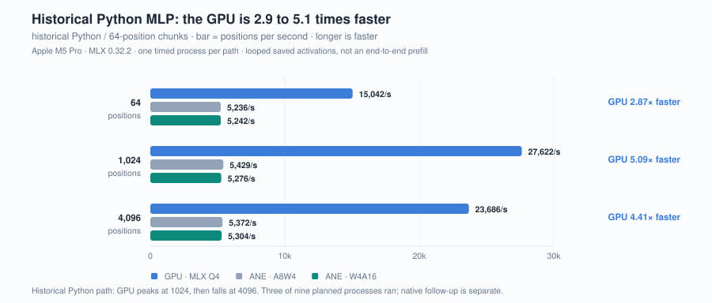
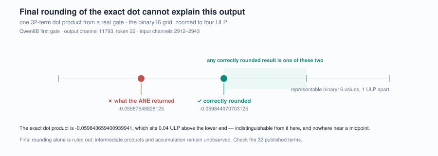

# Figures and their evidence

Standalone SVGs cover the fresh suites, imported component and complete-model
measurements, and diagrams of the documented methods. Drawing them runs no
device experiment. Boundaries that apply to every number are in [SCOPE.md](SCOPE.md);
full tables are in [MEASUREMENTS.md](MEASUREMENTS.md) and the reasoning is in
the [articles](../articles/README.md).

Every figure carries a title, a description and an accessible label; none
contains a script, an external font, a linked raster or an outbound reference.
Colours are declared as CSS classes with a `prefers-color-scheme` override, so
one asset stays legible on a light or a dark document background, and a
renderer that ignores the media query gets the light palette.
[manifest.json](figures/manifest.json) records each figure's source paths and
the exact plotted values or semantic scope.

## The comparison



**The same weights, two engines.** Source:
[ane-vs-gpu-prefill.json](../results/historical/ane-vs-gpu-prefill.json). Bar
length is speed — positions processed per second — so longer is faster and the
flat Neural Engine line is visible directly against the GPU, which peaks at 1024
positions and falls at 4096.
Latency percentiles for the same runs are in the finding. One timed process per
path, of three planned.
[The finding and its caveats](../findings/ane-vs-gpu-prefill/).

## Plots recomputed from the records


**Throughput by process.** Source: [throughput.json](../results/fresh/throughput.json).
Each bar is the median of three process rates, each recomputed as source
operations over that process's p50 from 30 stored durations; the label gives
the full range across the three. Ratios pair each quantized arm with the same
runtime's FP16 arm in the matching round.


**Paired SplitConv latency.** Source: [split.json](../results/fresh/split.json).
Each line joins the two arms of one paired round; it is not a trend over time.
The latency axis starts at zero, so distances from the axis stay proportional
to latency. The historical 4.44× pair is a separate run and is not drawn here.


**One output, two references.** Source: `coreai-w8a8-128`, process 1,
original-input control in [throughput.json](../results/fresh/throughput.json).
Both residuals use the same output hash. RZA was chosen before this run; RNE is
a diagnostic comparison kept outside the admission gate. These are reference
residuals, not a before-and-after repair.



**A dot product outside its own bracket.** Source:
[dot-localization.json](../results/historical/dot-localization.json). The axis is
the binary16 grid, four ULP wide, centred on the correctly rounded result. The
exact value sits 0.04 ULP above the lower end of the bracket, so it is drawn as
one point with it. [The finding](../findings/fp16-dot-residual/).

## Diagrams of documented method


**Evidence pipeline.** Source: [METHODS.md](METHODS.md). Separates the
persisted-asset audit, numerical checks, resource limits and observed ANE
participation. A failed admission is preserved as an observation with no
benchmark timing. It describes the current package, not a retroactive claim
about every historical run.


**Wide versus split structure.** Sources: [METHODS.md](METHODS.md), the
[exporter](../src/ane_scope/_coreai.py) and
[reference preparation](../src/ane_scope/references/prepare.py). Sixteen K32
convolutions and fifteen FP16 adds per layer become 32 convolutions and 30 adds
over two layers, with one inter-layer QDQ and no final QDQ. These are graph
operations inside one host prediction. The K64 fixture at the bottom is a
separate experiment with different scales, input and output shape.


**Reproduction workflow.** Source: [REPRODUCING.md](REPRODUCING.md). Every
suite uses a new run directory. `verify` rechecks recorded evidence and reports
source identity; it does not turn a changed implementation into a freshly
tested one.


**Three arithmetic questions.** Source:
[article 03](../articles/03-arithmetic-compatibility.md). A conceptual
distinction, not a measured causal path. A compatible runtime can still
implement a recipe whose output differs substantially from FP16.


**Exact-grid scale controls.** Source: the four `coreai-qdq-*` cases in
[smoke.json](../results/fresh/smoke.json). Error columns use the original
input; the ANE column covers all four controls. Every listed input lies on an
exact grid with no midpoint tie and no saturation. The dependence on scale and
expression is observed; no internal compiler behaviour is proven.

## Check or regenerate

Reading the committed SVGs needs nothing at all. Checking or regenerating them
needs only the Python standard library:

```sh
python scripts/render_figures.py --check
python scripts/render_figures.py --write
```

`--check` regenerates every figure and the manifest in a temporary directory,
compares them byte for byte with the published files, and validates the figure
inventory, SVG structure and accessibility. It detects a stale or hand-edited
asset; it does not rerun the device.

`--write` is deterministic: the same repository state produces byte-identical
files. Generation imports no plotting stack, no benchmark runtime
module and no device API, reads only the small bundled evidence bundles, and
performs no installation or network access.

## G2 service plots

The seven G2 plots use the same 900-pixel canvas, font stack, type scale and
light/dark colour tokens as the existing figures. Their data come from the
separate [imported G2 bundle](../results/historical/g2-w4a16-night/), recomputed
by `scripts/g2/evidence.py` before rendering. [G2 scope](SCOPE.md#g2-service-observations) applies to all seven.

| Figure | Display rule |
|---|---|
| [Seven-size throughput](figures/g2-throughput.svg) | All three host curves plus medians; log₂ position spacing; no pooled calls or confidence intervals |
| [Load, temperature and fans](figures/g2-load-fans.svg) | All six equal-rate pairs and four saturated blocks against completed requests/s; window means and final five-minute medians labelled; unmeasured GPU load range shaded; fan 1 values in the caption |
| [Matched-rate thermal response](figures/g2-matched-rate-thermal.svg) | All six paired mean differences; two orders, CPU and GPU sensors; platform limitation visible |
| [Saturated temperatures and fans](figures/g2-saturated-thermal.svg) | All four blocks, both temperatures and both fans; observation-relative time; unequal work stated |
| [Foreground tails](figures/g2-coexistence-tails.svg) | All eighteen slots; p95/p99, per-panel millisecond axes, start classifications; memory anomaly retained |
| [Memory](figures/g2-memory.svg) | All audited samples for all-owned RSS and component footprint, with distinct limits; no inferred continuity across gaps; the caption attributes the coexistence-phase rise to the foreground |
| [Tile diagnostic](figures/g2-tile.svg) | Three same-host N1024 tile64/tile256 pairs, reported separately from the main curve |

Temperature traces break across gaps above ten seconds, resource traces above
two seconds. Rendering does not downsample the data. The seven figures expose
observations under the reported display condition; none converts CPU process
percentages to GPU overhead or temperature to energy.

## G3 complete-model figures

The G3 figures use the same Canvas, ANE teal and GPU blue as the component plots. Each point is rebuilt from the [portable G3 request and power fields](../results/historical/g3-qwen3-4b/); the manifest lists the exact sources and plotted values.

| Figure | What it shows |
|---|---|
| [g3-speed.svg](figures/g3-speed.svg) | Warmed prefill/decode block throughput, including host and request gaps |
| [g3-power.svg](figures/g3-power.svg) | Mean CPU + GPU + ANE power over those same blocks |
| [g3-energy.svg](figures/g3-energy.svg) | Component energy for both paths: prefill in mJ/input token, decode in J/output token, with timing-attribution bounds |
| [g3-implied.svg](figures/g3-implied.svg) | Prefill FLOP/s over projection weights and modelled decode byte rates including KV growth; dashed line is the same-machine ANE synthetic FP16 chain |
| [g3-coverage-speed.svg](figures/g3-coverage-speed.svg) | Separate single-request coverage with prefill and subsequent decode |
| [g3-decode-kv.svg](figures/g3-decode-kv.svg) | Consecutive decode segments against actual KV length |

Context ticks are the measured sizes; lines connect observations without claiming measurements between them. All rate and energy axes start at zero. Model loading, separate warmup and recovery are outside the main blocks. Whiskers are sample-timing bounds, not confidence intervals or calibrated sensor accuracy. The implied rates assume two FLOPs per projection weight per token and one full weight and existing-KV read per decode step, including cache growth; they exclude current-token writes and fixed-graph padding and measure no device counter. [Full scope](SCOPE.md#g3-complete-model-observations).

## G4 A figures

The G4 A figures reuse the Canvas and colours. Their footnotes use larger type and short lines; adjacent page text carries the timing, energy and attribution limits. Every point is rebuilt from the [G4 A bundle](../results/historical/g4a-qwen3-4b/), the G3 bundle for the comparison and, for the disk figure, the [redacted disk observations](../findings/ane-compiler-service-disk/evidence/).

| Figure | What it shows |
|---|---|
| [g4a-speed.svg](figures/g4a-speed.svg) | Prefill (log scale) and decode speed at six inputs: GPU, ANE with matched graphs, and G3's ANE on the 256 / 2K / 32K ladder (dashed; decode over its first 256 steps) |
| [g4a-implied.svg](figures/g4a-implied.svg) | Prefill TFLOP/s split into projection and causal attention, and decode read GB/s split into weights and existing KV, for both paths at every input; dashed line is the ANE synthetic FP16 chain |
| [g4a-energy.svg](figures/g4a-energy.svg) | Component energy per token stacked by CPU, GPU and ANE counter for both paths, with timing bounds on the total; † marks a block whose CPU median power exceeds 1.35× both neighbouring inputs |
| [ane-compiler-disk.svg](figures/ane-compiler-disk.svg) | Free space through the G4 A run with host sessions shaded, and the release when the compiler service ended |

Ticks are the measured inputs; lines connect observations without claiming values between them. Rate axes start at zero except the prefill panel of g4a-speed, which is logarithmic so the ANE curves remain readable. The implied rates exclude fixed-graph padding and current-token writes and measure no device counter. [Full scope](SCOPE.md#g4-a-matched-graph-observations).

