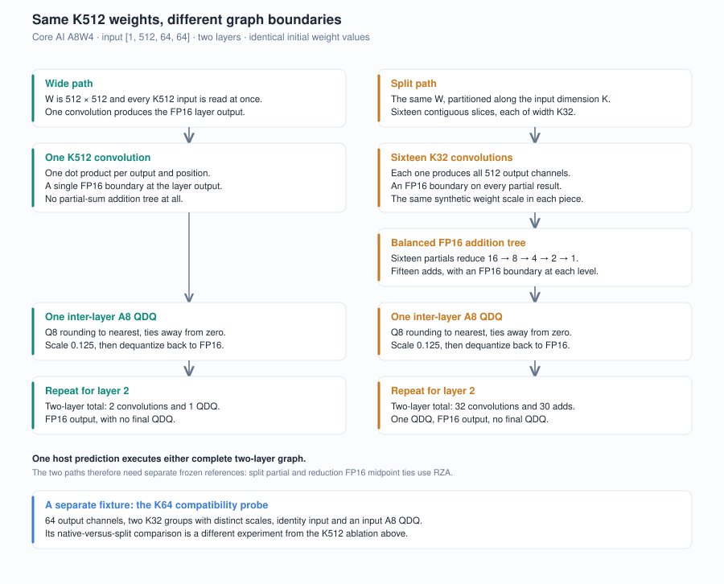

# Experimental methods

Five things are kept apart and never collapsed into one verdict: numerical
correctness, serialised representation, compiler eligibility, observed device
participation, and performance. A requested compute unit or a declared low-bit
type is not evidence of any of the others. Incorrect outputs, CPU choices and
incomplete evidence stay recorded as observations with no benchmark time.
[SCOPE.md](SCOPE.md) states what the resulting numbers mean.

## The fixture

Every fixture is model-free and deterministic. The chain uses 512×512 signed
Hadamard matrices, independently permuted and sign-flipped per layer with seed
20260910. Weight scale is binary16 `0.044189453125`. A held-out input seed
20260912 generates 16 independent spatial vectors of Q8 codes in [-8, 8],
scaled by 0.125, tiled to 4096 positions.

FP16, W8A8 and A8W4 all start from identical initial weight values; the two
quantized formats insert an activation QDQ between layers. Their arithmetic
references therefore differ from FP16, and a latency comparison between them is
a representation control, not a matched-quality model evaluation.

The FP16 reference uses FP32 dot products with binary16 rounding at the
boundaries. The quantized reference uses exact bounded integer dot products,
the declared scales, binary16 intermediate boundaries, and Q8 nearest rounding
with ties away from zero (RZA). A separate ties-to-even (RNE) reference is kept
for comparison and is **never** substituted after an output has been observed.

## Numerical admission

Every process receives four inputs: original, zero, sign-negated and repeated
original. A linear chain or group probe must negate its output with its input;
a multiplication probe must preserve it. References, outputs and files are all
hashed. The repeated original output must be byte-identical, every output must
be finite, and the zero case must be numerically zero. A non-zero positive or
negative control under a relative-L2 gate additionally requires at least 25%
non-zero output.

Chain relative-L2 limits are 0.01 at depth 2 and 0.05 at depth 128 — inherited
synthetic-control engineering thresholds, not universal quantization criteria.
Exact-grid group and multiplication probes and the SplitConv profile require
zero numerical difference, with signed-zero bit differences reported
separately. A failing compatibility result is never admitted
to timing.

## The split profile

The split profile uses two layers of 16 contiguous K32 dot products, a balanced
adjacent FP16 addition tree, and one inter-layer QDQ. Its reference models FP16
midpoint ties away from zero at the partial and reduction boundaries. Wide and
split therefore carry separate frozen references: the change in reduction and
rounding boundaries is part of the ablation.

## Serialised assets and device evidence

Core ML assets are reloaded from their persisted protobuf and weight blob. The
audit follows convolution, QDQ, slice and add operands, checks codes, scales
and zero points, and independently materialises the weight values. Core AI
assets are reloaded from bytecode through a version-specific internal reader;
signed INT8 and packed four-bit palette indices are decoded independently while
following weight and graph operands. **An unrecognised representation fails the
audit.**

The Swift Core ML host compiles the saved asset, reads the model description
and a compute plan, and records supported and preferred devices. The Core AI
host requests Neural Engine specialization, validates function, input and
output names and the actual output shape and dtype, and records that
per-operation mapping is unavailable. Its input NDArray shape and dtype are
explicit and the persisted graph signature is audited before execution.

Target-PID unified logging runs around loading and the four controls. Each
control's window must contain a successful ANE request for timing admission.
Core ML additionally requires every audited convolution to prefer ANE. Core AI
admission uses control-window participation plus the requested specialization
and the loaded function identity.

## Timing and replication

The full control is 128 convolutions at `[1, 512, 64, 64]`. Source work is
`2 × depth × 512² × 4096` operations, a MAC counting as two. The wide/split
comparison uses depth 2 and the same denominator, so an additional *graph*
operation is not an additional *source* operation in this metric.

Each timing process performs the four controls, then 10 warmups and 30 measured
synchronous predictions. Output copying, finite checks, hashing and file writes
all happen after the timer stops, and unified log capture is stopped before
timing begins. The first and last timed outputs are retained, and every timed
output hash must equal the original control. Physical footprint growth from
warm to measured must be at most 32 MiB.

Three fresh processes per arm run in forward, reverse, forward order. Reported
values are per-process p50 and p95, paired round ratios, and the range across
process medians — see [SCOPE.md](SCOPE.md#how-to-read-a-spread) for how to read
that range.

## Small compatibility fixtures

The group fixture is signed INT4 `[64, 64, 1, 1]` with two K32 scales per row,
alternating exact 0.125 and 0.25 scales, and an identity input. Input A8 QDQ
uses declared per-input-channel scales. Core AI uses a four-bit INT8 LUT plus
scale; Core ML uses direct signed INT4 blockwise scaling. These are different
frontend representations, so their outputs and device choices do not isolate a
single shared compiler stage. The flattened-scale reference is a separately
generated candidate error prediction, frozen before comparison.

The multiplication fixture uses inputs 2 and 8 on an exact grid, with equal
scales (2, 2), unequal scales (0.5, 2), reversed construction order and an
explicit quantization expression. These are minimal semantic probes, not
comprehensive multiplication tests.

The original Gemma-derived group fragment had 15360 output rows; the model-free
probe here has 64. Device choice differs across those shapes, and each
is reported. Historical methods and versions are in
[HISTORICAL.md](HISTORICAL.md) and [PROVENANCE.md](PROVENANCE.md).

## G2 component service protocol

This imported experiment has its own protocol; the model-free synthetic fixture
above is not its workload. The [G2 protocol record](../results/historical/g2-w4a16-night/protocol.json)
contains the frozen phase/group definitions, source and asset identities, and
engineering limits. [G2 scope](SCOPE.md#g2-service-observations) defines the
interpretation boundaries.

The workload is one full four-stage MLP from same-source Q4_0 weights. At N<256,
ANE uses tile64; at larger N it uses tile256. MLX executes the whole request.
Each P2 cell has three saved-input controls, zero and a repeated first input,
then ten warmups and thirty measured requests. Seven sizes and a same-host
N1024 tile diagnostic produce 45 cells in six hosts. Each cell's rate is
N × 30 / sum(client seconds); medians are taken across hosts, not pooled calls.
Quantiles linearly interpolate at (sample_count − 1) × q.

P0 uses four fresh C/G/G/C hosts, each with 512 measured N4096 requests plus
five controls and ten warmups. Natural checkpoints are 0/32/64/128/256/512.
The original memory-envelope amendment and previous stopped attempts remain
part of workspace provenance; their device samples are not mixed into r4.

The service phase freezes arrival offsets from independent inference and
foreground pilots. P1 has matrix loads at 0.5F/0.75F and a memory-access load at
0.5F, each alone, with ANE and with GPU, in two orders: eighteen four-minute
observation slots. P3 uses 0.25R/0.5R/0.75R, two orders, with six-minute windows.
R is the slower inference pilot rate; each foreground uses its own F. All
arrivals, terminal states, deadlines and drain completions are retained. The
four saturated C/G/G/C blocks observe sixteen minutes each, without an offered
arrival rate; request caps are checked for censoring.

Thermal starts use the final thirty seconds of setup, after loading and warmup.
The frozen group rule checks six distinct sensor samples spanning at least
25 seconds, gaps at most ten seconds, median temperature spread at most 2°C,
fan spread at most max(200 RPM, 10% of the lowest median), and matching covered
thermal states. Unmatched groups remain in the results. The portable classifier
is copied from the recorded workspace source, identified in provenance.

A final five-minute window is an approximate platform only when both temperature
OLS slopes versus actual time have magnitude ≤0.2°C/min, minute-completion
range/mean is ≤5%, there is no thermal-state upgrade, and coverage is sufficient.
This engineering rule does not establish equilibrium. Plot sensor gaps above
ten seconds and resource gaps above two seconds are broken, never interpolated.

G2 retained normal personal-PC background. The screensaver report is an explicit
post-run annotation; it does not change frozen acceptance classifications.
No display-off control was run. The whole-capture power
acceptance failed.

## G3 complete-model stages

The [G3 protocol](../results/historical/g3-qwen3-4b/protocol.json) fixes Qwen3-4B source revision, FP16 precision, input IDs, cache capacity, function shapes and host identity. Both paths use Core AI, with separate model assets and engine implementations. A coverage request includes prefill and subsequent decode; the main stage figures instead use warmed repeated prefill or a continued decode request. Each prefill resets its KV and samples the first output. Stage decode starts at the stated initial KV and evaluates <!-- claim:g3.decode-steps@g3-001 -->1,024<!-- /claim --> sequential forwards with free continuation, continuing through EOS.

The importer keeps complete request results and commands, token-end clocks and graph begin/end events. The portable validator checks reset and carry state, counts, sequential graph work, KV progression and phase clocks. It then sums completed input or decode tokens and divides by the interval from the first request's start to the last request's end. Dispatch and recording gaps within this interval are part of the block. Loading, separate warmup and recovery lie outside it.

The primary energy source is Apple's `powermetrics` CPU, GPU and ANE energy counters, extracted from each complete plist frame. macmon and auxiliary channels were collected for observation; their mixed system-power values do not enter the primary energy sum. The portable bundle includes selected source plist fields and receipt anchors, plus original raw-frame byte ranges and hashes. The parser recomputes power/energy consistency, source timestamp mapping and receipt continuity before integration.

The source timestamp is quantized, and its relation to the sample endpoint is not calibrated. Each sample is assigned the union of timestamp-at-start and timestamp-at-end possibilities, widened by an assumed counter lag. The primary lag assumption is <!-- claim:g3.primary-lag@g3-002 -->2 s<!-- /claim -->; other sensitivity cases are in protocol.json. The estimate uses the midpoint of this interval and a uniform-energy-within-sample assumption. Samples that are wholly inside a work window contribute to the lower bound; any sample that may overlap contributes to the upper bound. These are timing-attribution calculations, not a calibration of Apple's estimator.

For each block, component energy is the sum of CPU, GPU and ANE joules. Dividing by completed tokens gives J/token; dividing by block seconds gives mean watts. Thus mean watts divided by block token/s gives the same J/token. There is no idle subtraction. The exact component breakdown and timing ranges are in [MEASUREMENTS](MEASUREMENTS.md#g3-complete-qwen3-4b-fp16).

A pair requires complete and equal work, a continuous power window and an active-versus-idle response in the corresponding accelerator domain. The response rule and all timing sensitivity cases are executable in `scripts/g3/power.py`. The original short prefill pair failed this rule on the GPU side; the longer r6 pair uses the ongoing r5 capture. Run IDs qualify request IDs, and the capture reference is checked explicitly. Host clocks label software boundaries; they are not timestamps for exclusive hardware occupancy.

The implied prefill rate counts two FLOPs per transformer projection weight per input token. Attention is listed separately using the approximate mean causal context `n/2`; normalization and the output head are outside the projection count. The tied embedding and output head share one stored weight matrix. The same-machine synthetic reference is the median Core AI FP16 chain rate from `results/fresh/throughput.json`, also counting two source-equivalent operations per MAC.

The decode byte model assumes one full FP16 weight read and one existing-KV read per forward. For `s` forwards starting at KV length `n`, it sums `s × weight_bytes + kv_bytes_per_position × (s × n + s × (s − 1) / 2)` and divides by the whole block's measured time. Existing KV means positions before each forward; current-token writes and fixed-graph padding are excluded. This accounts for cache growth during the block. It estimates effective model bytes, not DRAM transactions, and a lower value than another engine does not identify a bottleneck.

## G4 A matched-graph stages

The [G4 A protocol](../results/historical/g4a-qwen3-4b/protocol.json) fixes the inputs, ANE capacities, GPU asset, continuation IDs, repetitions, prefill counts, quiet and tail periods and the admission margin. Inputs run from the largest to the smallest, and the first path alternates between inputs. For each input and path one host session loads the model and runs a boundary request of 257 outputs with graph telemetry, waits <!-- claim:g4a.quiet@g4a-001 -->25 s<!-- /claim --> idle, runs <!-- claim:g4a.repetitions@g4a-002 -->3<!-- /claim --> teacher-forced full requests, waits again, runs the prefill block (<!-- claim:g4a.prefill-counts@g4a-003 -->130 / 90 / 55 / 34 / 15 / 7<!-- /claim --> one-token requests for the six inputs) and closes after a short tail. Every host must close cleanly. Before each load the runner waits until the volume's important-usage capacity is at least the recorded gate.

The portable validator adapts the G3 token contract to a fixed capacity per request: output counts, token clocks, phase clocks, reset state, final KV within capacity, and forced IDs equal to the generated IDs. For the boundary request it also walks the graph events: sequential device work, KV progression and, on ANE, the capacity in every graph name and the query width of 64 for prompt chunks and 8 for decode.

A decode block's windows are first to last token of each full request; its rate is <!-- claim:g4a.decode-steps@g4a-004 -->256<!-- /claim --> steps per request divided by the summed window time. A prefill block's single window runs from the first request's start to the last request's end. Energy integrates the union of a block's windows, counting each power sample once with the same endpoint, lag and midpoint rules as G3; lower and upper bounds use wholly-inside and possibly-overlapping samples. A block is admitted when the capture's power stream is complete with no clock issues, the block ends at least <!-- claim:g4a.margin@g4a-005 -->15 s<!-- /claim --> before the last power receipt, the accelerator domain responds to the work under the G3 response rule, and timing coverage holds at 0, 1, 2 and 5 s lags. All requests must use the protocol's decode query width. The recomputation must equal the request statistics, block rates, integration-window fields, energy bounds, normalized energy, response and admission the runner recorded.

A block's CPU median power uses samples wholly inside its windows with no lag. The energy figure marks a block whose median exceeds 1.35× that of both neighbouring inputs on the same path.

G3 comparison: prefill uses G3's primary prefill pairs; decode uses the first 256 token clocks of each G3 decode block, from request start to the 256th token's end, and integrates G3 energy over that window with the G3 single-window rule, which must pass its integrity checks.

The implied rates reuse the G3 model-work counts. Prefill adds causal attention FLOPs at `n/2` mean keys to the projection FLOPs. Decode splits the per-step read into `weight_bytes` and `kv_bytes_per_position × (n + (s − 1) / 2)` for `s = 256` steps from KV `n`, multiplied by the measured decode rate.

The disk table pairs each host session with the last load-gate reading before it; rows that waited below the gate precede it. The change for a session is the difference to the next session's reading.

## G6 query width, W4 and repeat

The [G6 protocol](../results/historical/g6-qwen3-4b/protocol.json) lists the segments of each capture. A query session loads one ANE tier in one host. For each decode width it runs a boundary request of 257 outputs with graph telemetry and checks that the decode graph events use that width's function; at 1K the first output is compared with the tier's reference (the HF FP16 reference, or for W4 the CPU model built from the exported codes). It then waits 25 s idle and runs three teacher-forced full requests, width by width, with the first width alternating between sessions; W4 sessions add the G4 A prefill block. Repeat arms run the G4 A procedure unchanged. An idle segment records its window with no host. Before each load the runner waits for the important-usage gate. Between captures it waits up to eight minutes for the reclaim task to act, then opens the next capture.

Blocks, windows, integration, bounds and admission follow [G4 A](#g4-a-matched-graph-stages), each block against the last power receipt of its own capture. The verifier also requires: every timed request's query to match its width; the boundary graph events to include the width's decode function at the tier's capacity; direct ANE requests in every FP16 admission log and none, with Metal shader compilations, in both W4 admission logs; ANE counter energy in every FP16 block; and in every W4 block zero ANE counter energy with the ANE response rule as the only failed admission condition. Repeat ratios divide each repeat block by the G4 A block recomputed from its own bundle. Idle power is the component energy over the window at the 2 s lag divided by its length. The recomputation must equal the rates, energy fields, admissions and idle power the runner recorded.

## G7 same codes in two runtimes

The [G7 protocol](../results/historical/g7-coreml-coreai/protocol.json) records the representations, limits, seeds and order. Both exporters read the same codes and FP16-rounded scales and neither recalibrates or re-clusters them; each saved asset is read back to check its codes, palette dtype, scale axis and QDQ boundaries. The CPU reference decodes the codes to FP16, multiplies in FP32 and rounds each QDQ to nearest with ties away from zero; GELU uses the tanh approximation in FP32. The limits apply to all rows and to ordinary rows (from row 6) of the original, sign-flipped and seeded inputs; the zero input must return zero and repeated inputs the same bytes.

Every block starts a new host, which loads the asset, runs the six control inputs while the host-PID unified log is streamed, and stops the log. The controls must pass before timing: the numeric screen, one successful direct ANE request inside each of the six control call windows, no ANE compile or fallback failure lines, and for Core ML the expected number of projection convolutions, each preferring the Neural Engine in the compute plan. The host then warms up for at least ten calls and 5 s, waits 25 s, and calls on the seeded input for at least 120 s (60 s for the synthetic chain), finishing the call in progress; it keeps only the start and end clock of each call and the final output, which must equal the control output for that input. Blocks run in groups by round, workload and positions, one power capture per group.

Speed is positions × calls over the block window. Energy integrates the component counters over the window at 0, 1, 2 and 5 s lags as in [G4 A](#g4-a-matched-graph-stages), with the 2 s estimate as the result; a block is admitted if its capture passed, the stream extends 15 s beyond it, every lag covers the window and the ANE counter rises within 5 s. The verifier re-applies the numeric, repeat, zero and placement rules to every recorded control, recomputes every block from its window, call count and power frames, and compares with the recorded measurement. Three of its checks go beyond the run's rules and are named as such: the zero output must hash to all-zero bytes, where the run counted nonzero values; every non-constant Core ML operation must prefer the Neural Engine; and each block must show ANE power above 1 W and GPU power below 0.05 W. All hold for every record. Ratios pair blocks of the same round. Idle power is the component energy over each 300 s window at the 2 s lag.

The Core ML QDQ probe builds the graph with the coremltools MIL builder, runs each arm in a new host with `cpuAndNeuralEngine` and with `cpuOnly`, and records the compute plan, the ANE requests in each control call and the six outputs. The verifier checks the saved graph's QDQ connections, paired scales, zero points and product-clamp bounds, that every output tensor holds one value, the zero and repeat controls, the placement, the substitution values on the unclamped Neural Engine arms and the reference values on every other run.
