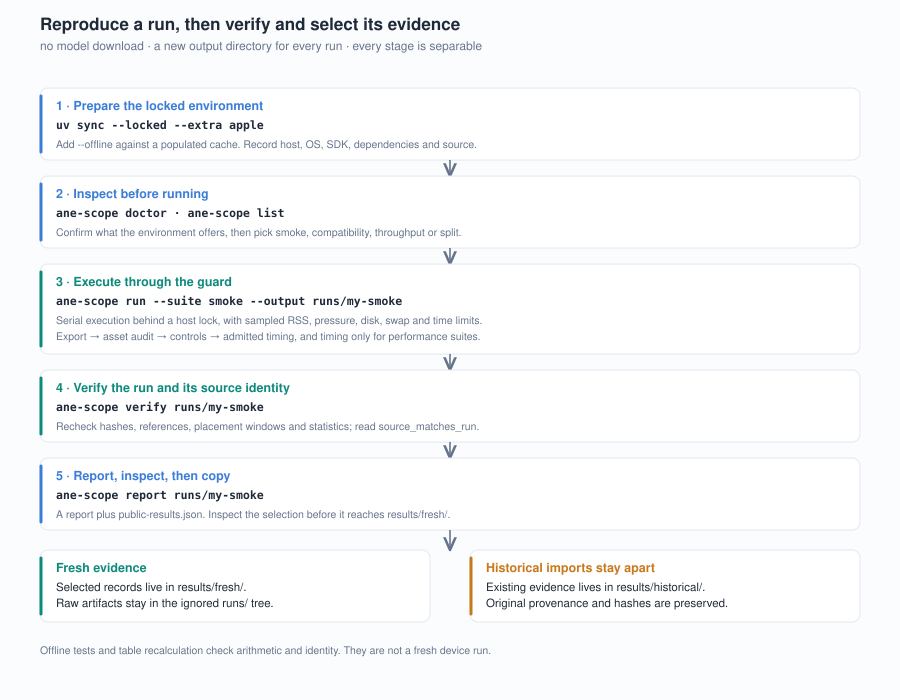

# Reproducing LLMs on Apple Neural Engine

The device suites were developed on Apple M5 Pro (48 GiB), macOS 27.0 build
26A428, Xcode 27.0 build 27A266a with macOS SDK 27.0, pinned to Python 3.12,
coremltools 9.0, coreai-torch 0.4.1 and coreai-core 1.0.0b2. Other hardware and
toolchains are unverified. The pure reference tests need only NumPy; Core AI
execution needs the Apple SDK and framework. Read [SCOPE.md](SCOPE.md) first
for what the resulting numbers do and do not mean.



The repository and Python distribution are named `llms-on-apple-neural-engine`.
The synthetic suites use the `ane-scope` command and `ane_scope` Python module;
these existing identifiers also appear in recorded source snapshots.

## Command reference

| Step | Command |
|---|---|
| Install | `uv sync --locked --extra apple` (add `--offline` against a populated cache) |
| Inspect | `.venv/bin/ane-scope doctor` · `.venv/bin/ane-scope list` |
| Run a suite | `.venv/bin/ane-scope run --suite smoke --output runs/NEW_NAME` |
| Verify a run | `.venv/bin/ane-scope verify runs/NEW_NAME` |
| Report a run | `.venv/bin/ane-scope report runs/NEW_NAME` |
| Reference tests | `python -m unittest discover -s tests -v` |
| Recompute the tables | `python scripts/summarize.py` (`--write` to regenerate) |
| Recheck native follow-up | `python results/historical/tests/verify_native_followup.py` |
| Check source identity | `python scripts/check_source_identity.py --check` |
| Check the figures | `python scripts/render_figures.py --check` |
| Recompute history | `python results/historical/tests/verify_historical.py` |

Defaults: a new output directory, serial execution, a 4 GiB sampled tree RSS
limit, a five-minute job limit and a 50-minute suite limit. No model or
credential is needed. Never run heavy suites concurrently or bypass the guard.

## Install

With Python 3.12 and `uv` available:

```sh
uv sync --locked --extra apple
.venv/bin/ane-scope doctor
.venv/bin/ane-scope list
```

Only this install command may fetch anything. `doctor` and `run` never download
models or dependencies. For a populated local cache, use
`uv sync --offline --locked --extra apple --python /path/to/python3.12 --cache-dir /path/to/cache`;
offline mode fails when a required package is absent rather than silently
reaching for the network. On other operating systems, install without
`--extra apple` for the reference tests.

## Run

Choose the command for the result you want to inspect:

| Result | Command | Execution |
|---|---|---|
| G3 complete Qwen3-4B speed and component energy | `python scripts/verify_g3.py` | Recompute bundled raw request and power fields; no device |
| G2 native W4A16 speed, memory, temperature and fans | `python scripts/verify_g2.py` | Recompute bundled observations; no device |
| Grouped-scale and QDQ toolchain defects | `.venv/bin/ane-scope run --suite compatibility --output runs/my-compatibility` | Synthetic device probes |
| Full compatibility smoke | `.venv/bin/ane-scope run --suite smoke --output runs/my-smoke` | Synthetic device probes |
| Quantized versus FP16 speed | `.venv/bin/ane-scope run --suite throughput --output runs/my-throughput` | Synthetic device benchmark |
| Wide versus K32-decomposed speed | `.venv/bin/ane-scope run --suite split --output runs/my-split` | Synthetic device benchmark |

G2 device replay still requires the research workspace and model assets; see
[G2 reproduction levels](#g2-recomputation-and-device-replay). The current Python
orchestration also awaits a new device smoke after source changes; see the
[validation status](VALIDATION.md#current-checkout-versus-the-measured-source).

```sh
.venv/bin/ane-scope run --suite smoke --output runs/my-smoke
.venv/bin/ane-scope verify runs/my-smoke
.venv/bin/ane-scope report runs/my-smoke
```

`smoke` executes 14 cases with four controls each. A negative result is a valid
observation: a supported operation may still select CPU. Export, compiler and
host failures stay failures in the manifest. The command returns non-zero on
incomplete execution or broken evidence rather than substituting a zero speed
for a missing result.

```sh
.venv/bin/ane-scope run --suite throughput --output runs/my-throughput
.venv/bin/ane-scope run --suite split --output runs/my-split
.venv/bin/ane-scope run --suite compatibility --output runs/my-compatibility
```

`throughput` first checks five depth-2 arms, then checks and measures depth 128
in three fresh processes per arm: Core ML FP16 and W8A8, Core AI FP16, W8A8 and
A8W4. `split` compares depth-2 Core AI A8W4 wide K512 against sixteen K32
pieces per layer with balanced FP16 addition. Each suite runs serially, process
order is forward, reverse, forward, and every timing process performs 10
warmups and 30 samples. The timer covers the synchronous prediction only:
output copying, checking, hashing, persistence and debug log capture all sit
outside it.

## Resource limits

The guard samples the owned process tree's RSS at startup and once per second
against a 4 GiB limit. It checks the macOS memory-pressure free percentage
(minimum 17%), disk free space (minimum 30 GiB), result-directory size (maximum
2 GiB excluding the environment), and swap — three consecutive increases above
64 MiB stop the suite. Device jobs have a five-minute ceiling; `--minutes`
bounds the suite and reserves a minute for verification. A host-wide file lock
prevents concurrent benchmark suites. Ctrl-C terminates owned children. No
power collector, `sudo` or system change is involved.

Sampling can miss a transient peak, and compiler or runtime services outside
the child tree are not fully counted. The free-percentage metric is the value
printed by `memory_pressure -Q`, not a direct free-byte count. These are
conservative experiment boundaries, not claims about total model memory.

## Evidence layout

A run contains `manifest.json`, generated `data/`, persisted `assets/` with
their audits, compiled `bin/`, per-process `runs/`, `jobs/` command, log and
resource records, and `source-snapshot/`. Every host records the full original,
zero, negative and repeat outputs; timed hosts also retain the first and last
measured outputs and a hash for every call. Target-PID unified logs are
captured only around loading and the controls. Core ML plans preserve supported
and preferred devices; Core AI records the requested specialization and the
observed ANE participation.

`verify` rechecks data, asset, host and output hashes, references, placement
windows and statistics. Its `source_matches_run` field distinguishes the
current verifier's source from the source that produced the run — evidence
consistency can be checked after a code change, but that does not mean the
changed implementation has been retested. The source snapshot and exact hashes
preserve the original version.

`report` produces a human-readable report plus `public-results.json`, a compact
evidence selection. Inspect that selection before copying anything into
`results/fresh/`; full logs, models, generated fixtures and compiled assets stay
in the ignored `runs/` tree. The public selection retains source and asset
hashes, controls, placement details and every measured duration row. Historical
evidence is separately labelled and is never overwritten by a fresh run.

## Checks that need no device

```sh
python -m unittest discover -s tests -v
python results/historical/tests/verify_prefill.py
python results/historical/tests/verify_native_followup.py
python results/historical/tests/verify_arithmetic.py
python results/historical/tests/verify_historical.py
python scripts/verify_g2.py
python scripts/verify_g3.py
python scripts/check_source_identity.py --check
python scripts/summarize.py
python scripts/render_figures.py --check
```

The portable tests cover midpoint rules, saturation, invalid scales, parity
controls and tampered evidence. `summarize.py` checks generated tables and
registered document values. Key values in both README openings have named
references: each marked occurrence checks its value and unit against its
evidence source. Other registered values use numeric boundaries within the
document. Unregistered prose remains outside these checks.

CI runs the commands above and also checks deterministic figure regeneration:

```sh
python scripts/render_figures.py --write
git diff --exit-code -- docs/figures
```

The Git comparison requires tracked figure files. In an uncommitted draft,
compare the complete SVG inventory and bytes against a saved copy instead.
These checks do not execute a device. The workflow supports push, pull requests
and manual dispatch.

## Version-specific interfaces

Core AI's bytecode reader and compression authoring modules are private,
version-pinned interfaces. A future package or compiler version may need a
separately reviewed adapter. Do not silently accept an asset the audit cannot
parse — a parse failure is the check working.

The current [validation record](VALIDATION.md#current-checkout-versus-the-measured-source)
separates recorded device checks from later source changes. The identity report
is portable and does not load a model. After an intentional source edit, review
its differences and run `python scripts/check_source_identity.py --write` to
update that comparison; this does not mark the edit device-validated.

## G2 recomputation and device replay

```sh
python scripts/verify_g2.py
python scripts/summarize.py
python scripts/render_figures.py --check
```

These standard-library commands read the imported [G2 bundle](../results/historical/g2-w4a16-night/).
The first checks file identities and recomputes per-host timing, all-arrival
service accounting, matched-input identities, thermal classifications and sampled
resource peaks. The next two check the derived tables and SVG identities.
No command here launches a model, changes system settings or requests power privileges.

| Level | Available here | What is still needed |
|---|---|---|
| Recompute the published scalar observations | Yes: selected fields for every service event and all relevant sensor samples | Python standard library |
| Repeat the original complete device/asset audit | Imported result and identities only | Original unified logs, numerical outputs, assets and workspace audit tools |
| Rerun the G2 device protocol | Not a public CLI suite | Model preparation, native/GPU hosts, guarded G2 controller and a compatible Apple host |

With the closed workspace available, `results/historical/import_g2.py` accepts
explicit `--workspace` and `--output` paths; the latter must be a new directory.
It extracts scalar fields only. A hash of an unavailable source identifies that
source, but does not make the source independently inspectable.

A future device replay should freeze its own display conditions and verify
what happens after the screen has been idle. Normal system background is not a
zero-process admission requirement. Any new results belong in a new run, separate from the
Ventura-conditioned r4 observations and their failed power acceptance.

## G3 recomputation and device replay

```sh
python scripts/verify_g3.py
python scripts/summarize.py
python scripts/render_figures.py --check
```

These standard-library commands check the complete-model bundle without an Apple device. The first re-parses selected power plist fields, validates every request's clocks and KV work, and recomputes coverage and stage metrics. The others check published numbers and generated SVG identity. The model weights, compiled assets and original reference logits are outside the portable bundle.

For a research workspace containing the closed source runs, create a new import directory explicitly:

```sh
python results/historical/import_g3.py --workspace /path/to/research-workspace --output /path/to/new-g3-bundle
python scripts/verify_g3.py --bundle /path/to/new-g3-bundle
```

Device replay needs the fixed model revision, separately exported ANE/GPU FP16 assets, the recorded Swift host and Core AI environment, input IDs, reference controls and an authenticated software capture. Those are identified in protocol.json and provenance.json. This repository's synthetic `ane-scope run` suites do not run the full-model G3 experiment. A portable full-model device launcher is not included.
