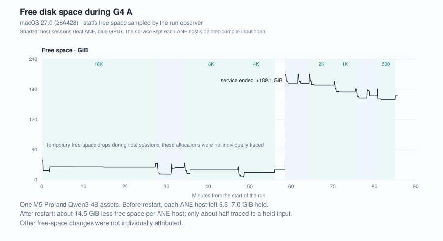

# ANECompilerService keeps deleted ANE compile inputs open

**Symptom.** Free disk space falls by roughly a model's size with each tested Qwen3-4B ANE load in a new process, and does not come back when the process exits. `du` finds nothing to delete. Observed on one M5 Pro with macOS <!-- claim:g4a.disk.macos@g4a-001 -->27.0 (26A428)<!-- /claim --> and Qwen3-4B FP16 ANE assets.

**What holds the space.** These Core AI ANE loads wrote an ANE-region file, `…ANE_region_0_0.bc.mlir`, under `$TMPDIR/com.apple.MetalPerformanceShadersGraph/mpsgraph-<pid>-…/`; for these assets each is <!-- claim:g4a.disk.file-size@g4a-002 -->6.77–6.79 GiB<!-- /claim -->. The system service `ANECompilerService` (root) opens it. When the loading process exits, its directory is removed, but the service keeps the file open, so the blocks stay allocated until the service itself exits.



The curve shows total free space on this machine. Changes beyond the identified held inputs remain unattributed.

## Evidence

- **What the service held.** A `sudo lsof +L1` listing taken during the [G4 A run](../qwen3-4b-graph-capacity/) shows one `ANECompilerService` process holding <!-- claim:g4a.disk.held-files@g4a-003 -->29<!-- /claim --> deleted `.mlir` files, <!-- claim:g4a.disk.held@g4a-004 -->178.4 GiB<!-- /claim --> in total; <!-- claim:g4a.disk.large-files@g4a-005 -->26<!-- /claim --> of them are <!-- claim:g4a.disk.file-size@g4a-006 -->6.77–6.79 GiB<!-- /claim --> each. The oldest came from a process that ran on <!-- claim:g4a.disk.oldest@g4a-007 -->2026-09-11<!-- /claim -->, two days earlier. Every owning process named in the paths had exited.
- **Ending the service releases it.** Free space was <!-- claim:g4a.disk.free-before@g4a-008 -->20.7 GiB<!-- /claim --> before the service was ended and <!-- claim:g4a.disk.free-after@g4a-009 -->209.8 GiB<!-- /claim --> after: <!-- claim:g4a.disk.released@g4a-010 -->189.1 GiB<!-- /claim --> released. That is more than the listing's total, which only includes files above 100 MB; the rest was not identified.
- **Each ANE host added one.** Before the service ended, free space at the next load was <!-- claim:g4a.disk.per-ane-host@g4a-011 -->6.8–7.0 GiB<!-- /claim --> lower after each ANE host and unchanged after each GPU host. The GPU 4K load then waited <!-- claim:g4a.disk.gate-waits@g4a-012 -->15<!-- /claim --> polls at its <!-- claim:g4a.disk.gate@g4a-013 -->30 GiB<!-- /claim --> load gate with <!-- claim:g4a.disk.gate-usable@g4a-014 -->28.9 GiB<!-- /claim --> usable, until the service was ended.
- **A restarted service does the same.** The service relaunched on the next ANE load. A second listing showed it holding one deleted input per later ANE host. Each of those hosts lowered free space by about <!-- claim:g4a.disk.after-restart@g4a-015 -->14.5 GiB<!-- /claim -->; the held input accounts for about half. The rest was not held open by any process; the load gate later counted that part as purgeable space. It was not located.
- **The reclaim task matches.** After the run, the [reclaim task](../../workarounds/#4-reclaim-disk-space-held-by-the-ane-compiler-service) ended the service while it held <!-- claim:g4a.disk.reclaim-files@g4a-016 -->3<!-- /claim --> deleted inputs (<!-- claim:g4a.disk.reclaim@g4a-017 -->20.3 GiB<!-- /claim -->); free space rose by the same amount. The service did not exit within 10 seconds of SIGTERM and was ended with SIGKILL.

The [evidence](evidence/) keeps both listings and the free-space readings with the per-user temporary directory written as `$TMPDIR` and the session user name removed.

## What it means

If your assets show the same retention, disk planning must include inputs held from exited processes since the service last started. Removing the `mpsgraph-*` directories does not help, because the files are already unlinked. `sudo lsof -nP -a +L1 -c ANECompiler` lists what the service holds; ending the service releases it, and the service relaunches on demand.

## Not established

- Whether smaller models, Core ML loads or other macOS builds behave the same. Only Qwen3-4B FP16 ANE assets on <!-- claim:g4a.disk.macos@g4a-018 -->27.0 (26A428)<!-- /claim --> were observed.
- Whether the file stays open inside `ANECompilerService` itself or because of how the compile request hands it over. Both are closed components.
- Whether the service would eventually exit on its own. It ran for days without doing so.

A minimal reproduction with a small model, run outside a measurement, is still to do; this has not been reported upstream.

## Recompute

```sh
python scripts/verify_ane_compiler_disk.py
```

Reads the redacted observations and the G4 A load-gate records; no device execution. [Workaround](../../workarounds/#4-reclaim-disk-space-held-by-the-ane-compiler-service) · [G4 A bundle](../../results/historical/g4a-qwen3-4b/)
