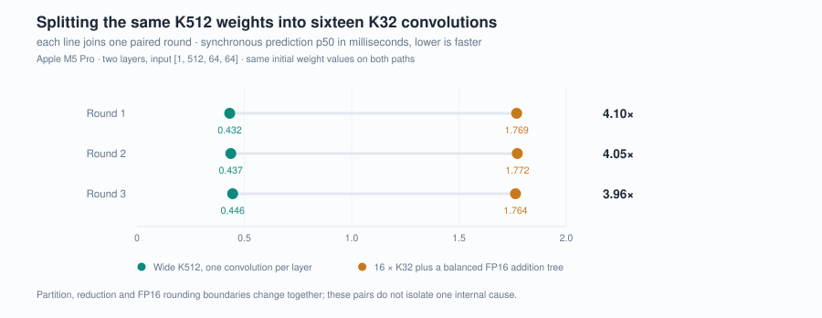

# A synthetic K32 decomposition runs about four times slower

## Symptom

A tested workaround for [Core ML's direct grouped-scale constraint](../coreml-grouped-scale-cpu/)
is decomposition. Here a separate Core AI synthetic ablation rewrites one K512 convolution as
sixteen contiguous K32 convolutions, each with a single per-output-channel
scale, and adds the partials back with a balanced FP16 tree.

In exact real arithmetic that is the same function. On the device it runs at
about a quarter of the speed.

| Case | Independent processes | p50 (ms) |
|---|---:|---:|
| `coreai-a8w4-2` (wide K512) | 3 | 0.432–0.446 |
| `coreai-a8w4-split32-2` (16 × K32 plus reduction) | 3 | 1.764–1.772 |

Paired by round, the wide path is **3.96–4.10× faster** than the split one:
4.10×, 4.05× and 3.96× across the three rounds. A historical single-process pair
recorded 4.44× — a different run, not pooled with these.



Both arms pass their own frozen numerical reference and both show ANE
participation in every control window. This is a cost, not a correctness
failure.

## Why the two arms need different references

Graph equivalence is not floating-point equivalence. The split path introduces
an FP16 boundary at every partial result and at every level of the reduction
tree; the wide path has one boundary at the layer output. Holding both to a
single reference would be wrong, so each has its own frozen one, with midpoint
ties away from zero at the partial and reduction boundaries. The change in
rounding boundaries is part of what is being measured.


Per layer: 16 K32 convolutions and 15 FP16 adds, against 1 convolution. Over two
layers: 32 convolutions and 30 adds, against 2. One inter-layer A8 QDQ, no final
QDQ, and one host prediction executes the whole graph either way.

## Reproduce

```sh
.venv/bin/ane-scope run --suite split --output runs/my-split
.venv/bin/ane-scope verify runs/my-split
```

Three paired process rounds in forward, reverse, forward order, 10 warmups and
30 measured synchronous calls each. Without a device, recompute the ratios from
the stored per-call rows:

```sh
python scripts/summarize.py
```

## What this does not show

**No single cause is isolated.** Partition, partial-sum boundaries, the
reduction tree, kernel selection for narrow K, fusion and scheduling all change
together between the two arms. What the data support is that the complete split
graph is about four times slower on this host — not that slicing, or narrow-K
kernels, or the addition tree, is responsible.

Isolating them needs a preregistered single-variable ablation over K, reduction
depth, output-channel count and representation, with effects that survive order
reversal. That is listed in [RESEARCH.md](../../docs/RESEARCH.md) and has not
been done.

The fixture is synthetic: Hadamard weights whose codes are ±1 times a shared
scale, and 16 distinct spatial vectors repeated across 4096 positions. It gives
a tractable reference; it is not a real group-scale distribution.

## Evidence

- [split.json](../../results/fresh/split.json) — every measured call
- [MEASUREMENTS.md](../../docs/MEASUREMENTS.md) — the recomputed table
- [METHODS.md](../../docs/METHODS.md) — the split profile and its reference
