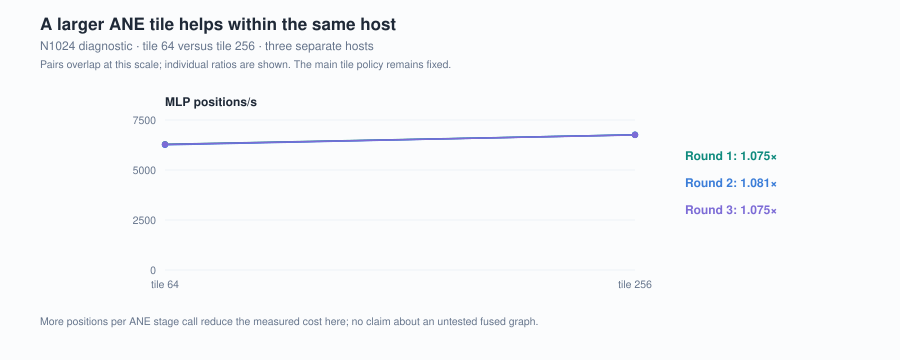
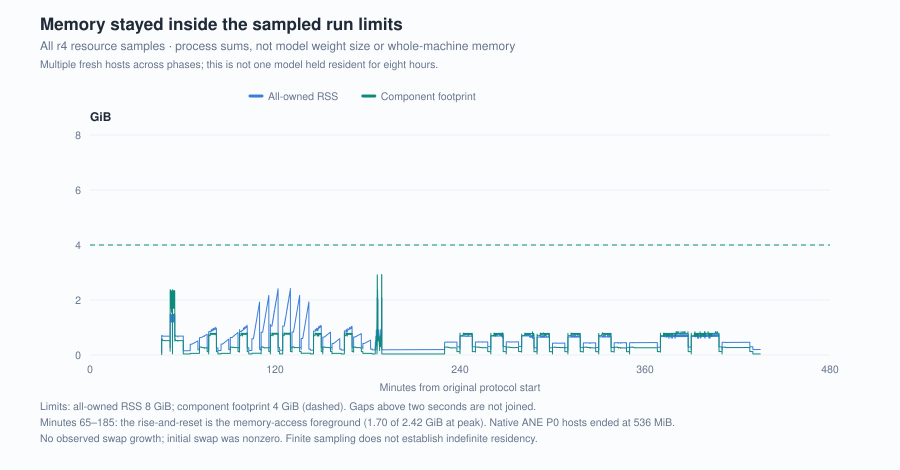

# W4A16 service: a quarter of the GPU's speed, flat memory, idle fans at equal load

The native ANE path now has a completed component experiment behind it. On one M5 Pro it
ran the MLP at **0.248×** the MLX GPU's speed, and at **0.270×** under sustained service.
Two native ANE hosts showed none of the historical Python per-call memory growth. At equal
load both engines left the fans at idle while the GPU sensor read a few degrees warmer;
fans rose only when the GPU ran flat out. A matrix foreground showed a smaller tail penalty
beside ANE inference than beside GPU inference.

Three conditions travel with these observations: an unintended Ventura dynamic screensaver
ran during the experiment, five of six coexistence groups had unmatched starting
temperatures, and the power capture failed its acceptance rules, so energy is undetermined.
[G2 scope](../../docs/SCOPE.md#g2-service-observations).

## The comparison

One Gemma 4 12B first-layer full MLP, same-source Q4_0 weights, FP16 input and
output. The native Swift host requests Core AI Neural Engine specialization;
MLX supplies the GPU baseline. The request includes gate, up, GELU_tanh/product
and down. The [method](../../docs/METHODS.md#g2-component-service-protocol)
defines each timing boundary and the separate numerical references.


At N1024, the median of three independent host rates is about **6,760 positions/s**
on ANE and **27,300 positions/s** on GPU. The figure shows all seven sizes, including the slower GPU N512
host; exact rates are in [MEASUREMENTS](../../docs/MEASUREMENTS.md). N is a position
count within this component, not a full-model context length. Above 256 positions the ANE
rate is flat because each request is split into fixed 256-position tiles. The
[historical Python comparison](../ane-vs-gpu-prefill/) and earlier native timing remain
separate records.

The same-host N1024 tile diagnostic gives **1.075–1.081×** more throughput with
tile256 than tile64 across three rounds. It identifies a useful implementation
choice without identifying the hardware ceiling.



Sustained service gives a different ratio. At saturation the ANE completed **6.4**
requests/s and the GPU **23.7**, putting ANE speed at **0.270×** the GPU speed. The service loop checks,
hashes and logs every response — about 4.4 ms per request on both engines — and that fixed
cost takes a larger share of the faster GPU's time. No overhead is deducted from either
number.

## Temperature and fans: equal load and full load


At three fixed arrival rates, all **14,244** inference requests completed and all six
starting pairs matched. Up to **4.9 requests/s**, the fans stayed at their idle speed on
both engines: the median block-start speed is about **1,350 RPM** for fan 0, and every
equal-rate window mean sits within a few RPM of it. The GPU sensor mean still differed:
GPU minus ANE was **1.33–3.29°C** across the six-minute windows (**1.3–3.3 °C** rounded),
and the CPU sensor 0.69–2.23°C. Most blocks did not reach a platform, so these are
transient observations, not equilibrium differences.


Fans separated only at full load. The ANE at **6.4 requests/s** left them at idle; the GPU
at **23.7** ran fan 0 at **3,100–3,500 RPM**, with final five-minute GPU sensor medians of
70.0–72.0°C against 57.5–58.8°C in the ANE blocks. All four windows met the recorded
platform rule and both starting pairs matched. The GPU completed about 3.7 times the work,
so these blocks cannot establish a fan advantage at equal work. Work rate and
execution path changed together; their contributions were not isolated.
GPU loads between 4.9 and 23.7 requests/s were not measured; where its fans
start to rise is the missing number.


## A coexistence signal, and a baseline that moves


Only the second 0.5F matrix group had matched starting thermal conditions.
Its foreground p95 was **30.921 ms** alone, **30.771 ms** with ANE inference and
**34.248 ms** with GPU inference. The figure also shows the other five groups, labelled as unmatched
starts. All twelve inference streams in the coexistence
phase completed their 792 requests without a soft-deadline violation.

All four matrix groups, matched or not, show the same pattern in both orders. With GPU
inference the foreground p95 rose **3.3–5.6 ms** above the alone slot. With ANE inference
it fell **0.144–0.151 ms** below it, almost identically in every group. Adding a workload
should not speed the foreground up, so the alone slot is not a zero-interference baseline.
One explanation to test: with only a light foreground running, the SoC may sit in a lower
performance state that any second workload raises; a CPU-only busy control would separate
that from real interference. The GPU penalty is more than twenty times that offset, so its
direction is steadier than the single matched group suggests. Its size is not: if the
animated screensaver drew on the GPU, a GPU already shared by foreground and inference
could lose more to it than one shared with the foreground alone.

The memory-access foreground shows the baseline effect more strongly. Its alone slots
violated deadlines on **13.50% / 13.37%** of arrivals, versus **5.75% / 5.83%** with ANE and
**12.36% / 12.34%** with GPU. That does not show that ANE improves memory performance; this
baseline needs explaining before any memory-access comparison is read. The full all-arrival
denominators are in [MEASUREMENTS](../../docs/MEASUREMENTS.md).

The hypothesis is that moving this inference to the ANE leaves more GPU capacity for the
foreground. A crossed animation-off/on comparison, repeated matrix trials with matched
starts and a CPU-only busy control would test whether the tail signal persists; if it
disappears under those controls, this run does not support that benefit. Fixed offered
load alone cannot measure maximum spare capacity.

## Memory: no per-call growth on the native host

Four fresh P0 hosts completed 512 measured N4096 requests each. The two native ANE hosts
made **33,728** stage calls each and ended **60–62 MiB** smaller than they started.
Retaining one gate output per gate call, as the [historical Python path](../iosurface-per-call-growth/)
did, would have added about **61.8 GiB** from gate calls alone. Host, pipeline, tile size
and run all differ from that Python round, so this is not an A/B test of the binding; it
shows the per-call growth is not a property of every entry point.

Across the 23,183 resource samples of the r4 device period, the peak component footprint
was **2.928 GiB** and all-owned RSS **2.419 GiB**, with no observed swap growth. The rise-and-reset in all-owned RSS during
the coexistence phase is the memory-access foreground, not an inference host. The
component peak occurred in P2; at the same N4096 size in P0, MLX hosts ended at
1.55–2.32 GiB and native ANE hosts at 536 MiB. Host recycling and finite observation are
part of this result; it does not establish indefinite residency.



## Recompute the observations

```sh
python scripts/verify_g2.py
python scripts/summarize.py
python scripts/render_figures.py --check
```

The [evidence bundle](../../results/historical/g2-w4a16-night/) contains selected
fields for every service event, all audited temperature/fan/resource samples,
the original classifications and source identities. Recalculation needs no Apple
hardware. Replaying the full numerical/device audit or rerunning the experiment
still needs the closed workspace and model assets; the public CLI does not yet
provide a G2 suite. See [reproduction levels](../../docs/REPRODUCING.md#g2-recomputation-and-device-replay).

This is a separate W4A16 experiment. A8W4 is paused; its reopening conditions are in
[RESEARCH.md](../../docs/RESEARCH.md).
